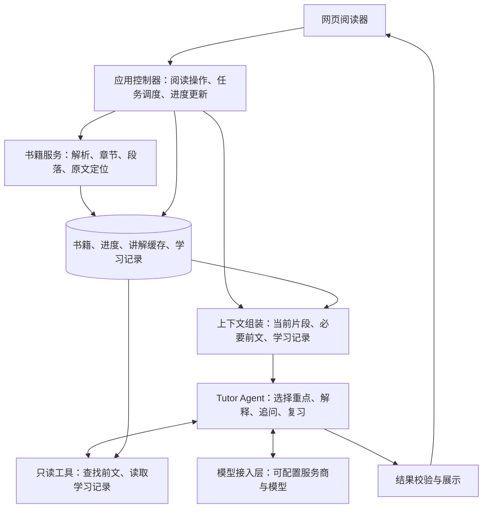

# NovelMentor：将英文小说阅读提示词拆成可持续运行的 Agent 架构

> 方案日期：2026-09-25；文档状态：架构与实施计划，尚未实施。

## 1. 目标与已确定的范围

将 [prompt.txt](../prompt.txt) 中的教学要求，落成一个**有书籍来源、有阅读进度、有学习记录、能按需调用工具的阅读导师**。

第一版首先解决你最在意的问题：**一次导入小说，之后在网页里连续阅读，系统自动取得当前原文和必要上下文。**

已确定的产品范围：

- **形态**：独立网页阅读器，部署在个人服务器，供自己跨设备使用。
- **输入**：EPUB、TXT、文字型 PDF。
- **默认体验**：原文、中文译文、精选知识点；详细讲解按需展开。
- **生成时机**：随读生成，后台最多预取下一个阅读片段。
- **学习功能**：词汇与表达记录、主动测验、答后讲评、阶段复习提示。
- **技术方向**：TypeScript 全栈，通过可配置的云端模型 API 调用。
- **第一版边界**：包含文字形式的 IPA 和发音提示；音频播放、扫描 PDF 的 OCR 后续扩展。

教学原则保留：按约 2000–3000 词汇量起步，优先维持故事连续性，讲解高价值知识点，中文翻译默认持续显示。原提示词的“70% 阅读、30% 学习”落实为**默认内容精简、详细内容按需展开、复习不强制打断阅读**。

## 2. 架构与 Prompt 拆分

采用 **一个核心 Tutor Agent + 按任务加载的教学指令 + 程序管理的阅读与学习状态**。

核心导师负责选择讲什么、如何解释、是否需要补充上下文。书籍定位、进度更新、记录保存、任务重试由程序执行。这样的职责划分也符合官方关于优先从单个 agent 起步、在职责确实需要隔离时再增加专家 agent 的建议。[OpenAI 编排指南](https://developers.openai.com/api/docs/guides/agents/orchestration)

原提示词拆成以下几部分：

| 拆出的职责 | 对应原提示词 | 实现方式与产物 |
|---|---|---|
| **教学政策 `TeachingPolicy`** | 总体原则、词汇选择标准、不要过度解释、减少中文依赖 | 精简的公共系统指令，加上结构化学习者配置；所有教学任务共享 |
| **书籍与阅读服务** | 每次处理范围、Original、“下一段” | 程序读取真实原文，提供稳定的阅读片段和前后位置 |
| **片段教学 `Lesson`** | 翻译、Vocabulary、Expressions、Writer’s Choice、Takeaways | 一次生成当前片段的译文与精选知识点，返回结构化结果 |
| **选区精讲 `Explain`** | 发音、词汇深度、长难句、语法、文化、作者用词、语气、指代 | 根据选中的词句或追问类型，只加载相关指令 |
| **复习教学 `Review`** | Mini Review、“考考我”“复习”、答后修改与解释 | 分为出题和讲评两个任务，分别返回题目与反馈 |
| **阅读上下文与学习记录** | 结合前文理解、避免重复讲解、根据能力调整 | 保存阅读位置、已讲知识点、用户标记和答题证据，按当前任务检索 |

其中，`Lesson`、`Explain`、`Review` 是同一个导师的三条教学流程，各自有独立 Prompt 和输出结构。公共教学政策只保存共同原则，具体格式放入对应任务中。

例如，点击一个词时，模型收到的是：

> 公共教学政策 + 词汇讲解指令 + 选中的词及所在原句 + 必要前文 + 该词的学习记录。

点击“这个句子没看懂”时，改为句法与指代讲解指令。这样可以保持原提示词的教学深度，同时控制每次调用的任务范围。

## 3. 阅读、追问与复习如何运行

**导入与连续阅读**

- EPUB 按文件中的阅读顺序解析，TXT 按段落解析。EPUB 的正文顺序以 `spine` 为依据。[EPUB 规范](https://www.w3.org/TR/epub-33/#sec-spine-elem)
- 文字型 PDF 使用 PDF.js 提取带位置的文本，处理断行和重复页眉页脚，并保留原始页码及文本映射。识别到空白提取或明显乱序时，显示具体问题和原页查看入口。[PDF.js 文本接口](https://mozilla.github.io/pdf.js/api/draft/module-pdfjsLib.html)
- 统一生成带稳定 ID 的 `ReadingUnit`，通常包含 1–3 个自然段；超长段落按句子边界拆分，并保留原段落归属。
- 原文直接从书籍服务展示。导入后的规范化文本与原始文件分别保存，排版整理可追溯。
- 阅读位置与“已经完成阅读的片段”分别记录。点击下一段可登记当前片段已读；目录跳转只改变位置，被跳过的内容保持未读。

**进入一个新片段**

1. 立即展示原文，读取已有讲解缓存。
2. 缓存未命中时，组装当前片段、最近前文、必要的已读内容摘要及相关学习记录。
3. `Lesson` 生成自然译文和精选知识点。词汇通常选择 3–8 个，内容简单时允许更少或为空；值得注意的作者用词、语气和指代可以进入重点提示。
4. 校验通过后展示并缓存。用户实际看到的讲解才登记为“已接触”。
5. 低优先级预取下一个片段。预取只准备讲解，不更新阅读进度或掌握程度。

**选词、选句与追问**

- 选区请求携带片段 ID 和文本位置，服务端重新取得原句，避免解释对象错位。
- Tutor Agent 可以调用 `get_passage`、`search_read_context`、`get_learning_evidence` 等只读工具补充材料。
- 每次请求都绑定允许读取的正文范围。回看前文时，提供的摘要也必须符合该位置，避免把后续情节带入当前讲解。
- 指代或人物意图缺少足够证据时，说明不确定之处；作者用词和潜台词分析区分文本事实与解释性判断。
- 支持简单、标准、深度三种模式。深度模式展开原提示词中所有适用栏目。

**学习记录与复习**

- 分开保存“建议主动掌握或被动认识”“曾经讲解过”“用户标记”“答题表现”。自动生成讲解只产生接触记录。
- 复习优先选择答错、反复求助和用户收藏的知识点，保留其原书语境。
- 默认每完成 **8 个新的阅读片段**提示一次复习，允许跳过；“考考我”和“复习”随时可用。使用片段计数，使 EPUB、TXT、PDF 的行为一致。
- 每次短测验最多 4 题，覆盖词义、用词辨析、中译英、短句理解；材料不足时减少题目。
- 答案与评分依据保存在服务端，提交作答后再返回判断、修改、解释和更自然的表达。
- 答题表现用于调整重点和复习顺序；中文支持程度由用户设置控制。

## 4. 实现边界、数据与接口

**工程默认选择**

前端使用 React、Vite、TypeScript；后端使用 Node.js 24 LTS、Fastify；数据使用 SQLite、Drizzle 和服务器文件存储；模型调用使用 AI SDK，输出用 Zod 校验。Node.js 24 当前处于 LTS 阶段。[Node.js 发布状态](https://nodejs.org/en/about/previous-releases)

模型层第一版接入 OpenAI 兼容的云端接口，配置服务地址、模型 ID 和服务端密钥。原生结构化输出按模型能力启用；其他情况使用 JSON 输出、服务端校验和一次有限修复。具体服务商与模型 ID 作为部署配置，不写入教学逻辑。[AI SDK 模型接入](https://ai-sdk.dev/providers/openai-compatible-providers)

**最小数据契约**

| 契约 | 必须表达的信息 |
|---|---|
| `ReadingUnit` | 书籍版本、片段 ID、章节、原文、原始位置、前后片段 |
| `TutorContext` | 当前片段、允许使用的前文范围、学习者配置、相关学习证据 |
| `LessonResult / ExplanationResult` | 对应片段或选区、译文或讲解、知识点类型、原文引用位置、不确定性说明 |
| `LearningEvidence` | 知识点、语境义、原书出处、接触记录、用户标记、答题结果 |
| `ReviewSession` | 题目、关联知识点、服务端答案、用户作答、讲评状态 |
| `AgentRun` | 任务类型、状态、输入版本、模型与 Prompt 版本、耗时、用量及错误信息 |

对外使用 REST 接口管理书籍、片段、进度、学习记录和复习会话；通过 `POST /api/tutor/runs` 创建讲解任务，通过任务查询与 SSE 获取进度和完成结果。

进度更新携带版本号，防止两个设备互相覆盖。生成任务按输入版本去重；复习提交按会话和题目幂等处理，避免刷新后重复记分。

**运行与校验规则**

- 固定阅读流程由应用控制器调度；需要补充证据的追问进入有界工具循环，默认最多 4 次模型调用，包含至多一次输出修复。
- 校验输出结构、原文位置、片段归属、知识点数量和必要字段。模型输出通过完整校验后，才成为正式讲解或学习记录。
- 缓存包含原文版本、任务与模式、相关教学配置和学习上下文、模型及 Prompt 版本。
- 当前请求优先于预取；默认最多一个前台生成任务和一个预取任务。任务状态持久化，服务重启后恢复未完成任务，重试受次数和总时限约束。
- 失败时保留原文阅读能力，允许重试对应讲解；旧请求完成后，只能更新其所属片段。
- 关键日志记录请求 ID、书籍与片段 ID、任务阶段、模型、耗时、用量、重试次数及错误类别。日志避免记录密钥、完整书籍正文和用户作答原文。
- 状态和任务类型使用枚举；数据结构添加 JSDoc，复杂分段、上下文边界和幂等逻辑添加意图说明。

部署采用单实例 Docker Compose、持久化数据卷和 HTTPS 入口，初始化一个个人账号，使用服务端会话登录。书籍文件、数据库和模型密钥均由服务端管理，并提供一致性备份与恢复步骤。

## 5. 验收场景与实施顺序

验收围绕真实阅读过程展开：

| 场景 | 通过标准 |
|---|---|
| 三种格式导入 | 章节或页码可追溯，连续翻阅无重复片段；提取异常能够定位和显示 |
| 中断后继续 | 刷新、重启服务、更换设备后恢复到已保存的位置 |
| 原文忠实 | 展示的原文来自保存的正文，模型生成内容不能替换原文 |
| 教学适配 | 简单片段允许零个重点；难词、搭配、长句、语气和作者用词按样例检查准确性 |
| 局部追问 | 点选词句后只展开相关内容，引用能回到准确原句 |
| 上下文边界 | 当前讲解及回看讲解不会读取位置之后的正文或摘要；缺少依据时说明不确定 |
| 预取与重试 | 预取不推进进度；重复请求不重复登记学习记录；失败结果可以恢复 |
| 复习闭环 | 作答前客户端拿不到答案，作答后能得到讲评，刷新不重复记分 |
| 模型接入 | 每个实际启用的模型均通过结构化输出、工具调用、中文讲解与样例质量验证 |
| 服务器恢复 | 从备份恢复后，书籍、进度、学习记录和复习结果保持对应 |

实施按四个可独立验收的阶段推进：

1. **阅读基础**：导入、解析、原文阅读、章节定位、跨设备进度。
2. **导师主流程**：拆分教学指令，实现译文与重点、选区精讲、缓存及下一片段预取。
3. **学习闭环**：学习证据、词汇与表达列表、测验、讲评和复习提示。
4. **运行交付**：登录、部署、任务恢复、日志、备份，并完成一次从导入小说到跨设备继续阅读和复习的完整验收。
