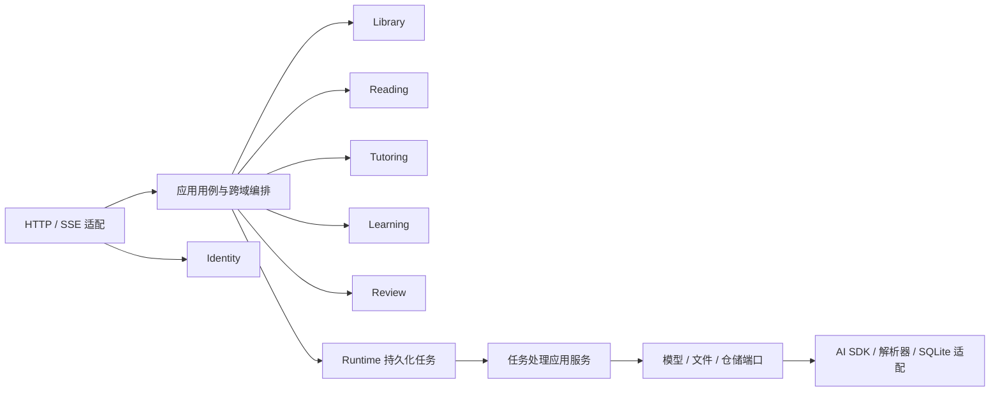
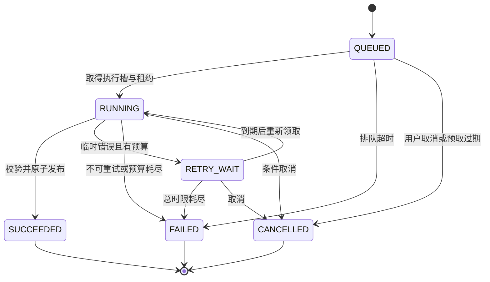

# NovelMentor DDD 开发设计

> 版本：1.0；日期：2026-09-25；状态：开发设计，应用尚未实现。
>
> 需求依据：[Agent 架构设计](agent-architecture-plan.md)、[英文小说阅读导师提示词](../prompt.txt)。本文是统一开发依据，覆盖领域建模、应用用例、数据与接口、前端协作、运行交付和验收。本文中的工程目录、接口、类型、表和配置均为待实现设计。

## 目录

1. [目标、范围与已确认决策](#1-目标范围与已确认决策)
2. [统一语言与业务不变量](#2-统一语言与业务不变量)
3. [限界上下文与协作关系](#3-限界上下文与协作关系)
4. [工程结构与依赖规则](#4-工程结构与依赖规则)
5. [聚合、值对象与领域策略](#5-聚合值对象与领域策略)
6. [应用用例与事务边界](#6-应用用例与事务边界)
7. [持久化模型](#7-持久化模型)
8. [类型与教学结果契约](#8-类型与教学结果契约)
9. [REST、错误与 SSE 契约](#9-rest错误与-sse-契约)
10. [任务执行、缓存与恢复](#10-任务执行缓存与恢复)
11. [前端状态与交互](#11-前端状态与交互)
12. [身份、部署与备份恢复](#12-身份部署与备份恢复)
13. [可观测性、配置与工程规范](#13-可观测性配置与工程规范)
14. [测试与验收](#14-测试与验收)
15. [开发工作包与交付顺序](#15-开发工作包与交付顺序)
16. [需求追踪与参考资料](#16-需求追踪与参考资料)

## 1. 目标、范围与已确认决策

目标是一次导入英文小说，跨设备连续阅读，并获得有原文依据、符合当前阅读位置的中文翻译、知识讲解和复习。用户默认水平为约 2000–3000 词汇量，阅读优先，讲解与复习不强制打断故事。

### 1.1 已确认决策

| 事项 | 决策 | 实现含义 |
|---|---|---|
| 文档覆盖 | 全栈，后端为主 | 领域、事务和接口详细设计；前端明确状态、交互和联调 |
| 架构形态 | 务实的模块化单体 | 一个部署单元和一个 SQLite 数据库，各域维护独立模型与公开应用接口 |
| 前端 | React、Vite、TypeScript | 按书库、阅读、学习、复习等业务功能组织 |
| 后端 | Node.js 24、Fastify、TypeScript | HTTP 适配、应用编排与领域模型分离 |
| 数据与模型 | SQLite、Drizzle、服务器文件、AI SDK、Zod | 模型提供商通过适配层接入，密钥保留在服务端 |
| 教学组织 | 一个 Tutor Agent，按任务加载指令 | Lesson、Explain、Review 共享政策，各有输出契约 |
| 上下文 | 当前片段及当前位置之前的已读内容 | 跳过的未读前文、回看位置之后的内容均不可进入讲解 |
| 运行环境 | 个人账号、单实例、跨设备、HTTPS | 身份与资源归属从第一阶段建立，最终通过 Compose 交付 |

### 1.2 首版范围与新增默认值

首版支持 EPUB、TXT、文字型 PDF，原文与中文译文、简单／标准／深度模式、词句精讲、学习列表、收藏、短测验、答后讲评和复习提醒。音频、OCR、多用户注册、跨书复习、自动跨版本迁移阅读进度留作后续能力。

以下是本开发设计补充的默认值，不属于已存在的代码行为：

| 项目 | 首版默认 |
|---|---|
| 工程管理 | pnpm workspace；依赖版本在建工程时锁定为通过兼容验证的稳定版本，提交锁文件 |
| SQLite 驱动 | `better-sqlite3`；本地磁盘，WAL，启用外键，单写入连接 |
| 文件上传 | 单文件不超过 50 MiB；EPUB 解压总量不超过 200 MiB、条目不超过 10000 |
| 阅读分段 | 通常 1–3 段，目标约 300 英文词，单片段上限 600 词和 12000 UTF-16 代码单元 |
| 阅读完成 | 明确点击下一段或完成本段；进入页面、生成讲解和滚动均不代表已完成 |
| 复习范围 | 当前书籍版本内、在当前上下文范围内且已接触的学习项 |
| 复习入口 | “复习”展示已有学习材料；“考考我”新建测验，不为复习材料列表额外调用模型 |
| 测验提交 | 每题首次接受的答案不可覆盖；再次练习需新建会话 |
| 学习项身份 | 同一原文位置和知识类型视为同一学习项；跨语境同词保留独立记录 |
| 书籍版本 | 新文件或新解析规则产生新版本；历史版本继续可读，不自动迁移进度 |
| 摘要 | 首版为带来源的已读原文摘录，不增加独立摘要模型任务 |
| 生命周期 | 首版书籍支持归档及取消归档；不提供物理删除，避免破坏学习出处和恢复能力 |

SQLite 驱动选择基于 Drizzle 的 SQLite 驱动支持；具体补丁版本在工程建立时通过集成测试锁定，不从文档示例直接复制预发布版本。[Drizzle SQLite 接入](https://orm.drizzle.team/docs/sqlite/get-started-sqlite)

## 2. 统一语言与业务不变量

### 2.1 统一语言

| 术语 | 定义 |
|---|---|
| Book／书籍 | 用户书库中的逻辑书籍，维护标题、作者、归档状态及默认版本 |
| BookVersion／书籍版本 | 原文件、解析版本、规范化规则及已发布正文的不可变组合 |
| ReadingUnit／阅读片段 | 用户连续阅读的最小导航单元，拥有稳定标识、顺序和来源映射 |
| SourceSpan／原文选区 | 某个版本、片段内规范化文本的左闭右开 UTF-16 范围 |
| Cursor／阅读游标 | 最近保存的阅读位置，可前进或后退，不代表此前所有内容都已读 |
| Completion／完成记录 | 用户明确完成某个片段的事实，同一版本内每个片段最多登记一次 |
| ReadingAccessScope／阅读上下文范围 | 当前目标片段，加上它之前明确完成的片段集合；由服务端计算 |
| TutorContext／教学上下文 | 冻结的目标、上下文范围、实际材料、相关学习证据和教学设置 |
| TeachingArtifact／教学结果 | 通过校验后发布的 Lesson 或 Explanation；不包含模型生成的替代原文 |
| KnowledgePoint／知识点 | 教学结果中的一条讲解，引用确定原文范围，标注类型及适用学习建议 |
| LearningItem／学习项 | 用户实际接触或明确收藏的、绑定原书语境的知识条目 |
| LearningEvidence／学习证据 | 接触或作答等已发生事实，追加保存，不能等同于“已经掌握” |
| ReviewSession／复习会话 | 一次 1–4 题测验，包含选材快照、私有答案、提交和讲评状态 |
| AgentRun／生成任务 | 一次有界模型任务的执行记录，区分业务目标、调度状态和调用预算 |

### 2.2 业务不变量

| 编号 | 不变量 |
|---|---|
| INV-01 | 展示原文只能来自发布后的规范化正文，模型输出不能覆盖正文 |
| INV-02 | 已发布版本的正文、片段顺序和来源映射不可原地修改 |
| INV-03 | 移动游标、完成阅读、看到讲解、答题表现是不同事实 |
| INV-04 | 当前讲解的全部输入来源都在服务端授权范围内，包括工具返回和派生材料 |
| INV-05 | 教学结果通过完整校验后才能发布；未经校验的模型增量不发送给客户端 |
| INV-06 | 预取只准备下一片段的讲解，不登记完成、接触或掌握 |
| INV-07 | 重复请求、重复接触确认和恢复重试不重复产生同一业务事实 |
| INV-08 | 跨设备进度更新必须进行版本比较，冲突不得静默覆盖 |
| INV-09 | 题目答案和评分依据在该题接受作答之前不可经任何客户端接口获得 |
| INV-10 | 评分、对应学习证据及生成任务成功状态原子提交 |
| INV-11 | 每次模型调用，包括修复及重试，都消耗同一任务的持久化预算 |
| INV-12 | 失败不阻止已发布原文阅读；迟到结果只归属其原任务和原片段 |
| INV-13 | 所有用户资源读取与写入都校验所属用户，客户端不提供可信的用户身份 |

## 3. 限界上下文与协作关系

| 上下文 | 定位 | 拥有的数据与规则 | 对外能力 |
|---|---|---|---|
| Library | 支撑域 | Book、BookVersion、导入、章节、正文、来源位置 | 查询版本、分页读片段、定位原文、发布解析结果 |
| Reading | 支撑域 | 游标、完成事实、进度版本、阅读范围 | 更新进度、生成范围快照、查询完成计数 |
| Tutoring | 核心域 | 教学政策、任务指令、知识点、教学结果与来源 | 准备教学请求、校验结果、查询可复用教学结果 |
| Learning | 核心域 | 学习设置、学习项、接触、收藏、求助事实和答题证据 | 查询相关证据、记录接触与表现、更新标记 |
| Review | 核心域 | 会话、选材、题目、私有答案、提交、讲评、提醒回执 | 创建测验、接受答案、发布讲评、管理提醒 |
| Identity | 通用域 | 个人账号、密码摘要、服务端会话 | 登录、退出、获取当前身份 |

Runtime 是技术支撑模块，拥有 AgentRun、执行租约、调用计数和 SSE 事件。导入使用 Library 自己的导入任务状态，通过通用租约设施运行，不把解析任务伪装成教学任务。



上下文之间共享标识和明确的快照契约，不共享可变聚合实例、不直接写其他域的表。Reading 使用 Library 提供的顺序信息；Tutoring 使用 Reading 范围、Library 正文和 Learning 证据；Review 使用学习候选和教学生成能力。Learning 不反向调用 Tutor 生成内容，跨域交互由应用编排器完成，避免循环依赖。

领域事件用于表达 `UnitCompleted`、`TeachingPublished`、`AnswerGraded` 等事实，但首版业务写入由明确的应用调用完成。需要保证成功的异步工作必须先保存任务；进程内通知仅用于唤醒调度器和 SSE，不承担唯一的业务交付责任。

## 4. 工程结构与依赖规则

```text
apps/
  web/src/features/                 # library、reader、learning、review、settings、auth
  server/src/
    bootstrap/                     # 配置、依赖装配、Fastify 插件注册、启动与退出
    workflows/                     # 跨域应用用例及原子提交编排
    modules/
      <context>/
        domain/                    # 聚合、实体、值对象、策略、业务错误
        application/               # 用例、仓储和外部能力端口、公开服务契约
        infrastructure/            # 仓储、解析器、模型及文件适配器
        interfaces/http/           # 路由、DTO 映射、输入校验
        public.ts                  # 唯一跨模块导出入口
    platform/                      # 数据库事务实现、日志、时钟、任务基础设施
packages/
  contracts/                       # 对客户端公开的 DTO、枚举、Zod schema
  shared-kernel/                   # Id、Result、时钟抽象等少量无框架类型
prompts/                           # 公共政策与按任务拆分的版本化指令
tests/                             # 集成、模型契约、端到端与固定教学样例
deploy/                            # Compose、反向代理、运行与恢复脚本
```

依赖约束：

1. 领域层只依赖本域模型和必要的 shared-kernel。仓储端口定义在应用层，由应用服务加载聚合、执行业务方法、保存结果。
2. HTTP DTO、Zod、Drizzle schema、SDK 类型不进入领域模型；映射由边界适配完成。服务端领域枚举与公共枚举使用显式映射，并测试所有成员覆盖。
3. 跨模块代码只能导入 `public.ts`，不能导入另一模块的 infrastructure 或 Drizzle 表。跨域查询通过公开查询端口组合。
4. workflows 获取同一事务下的各域应用操作对象，各对象内部使用自己的仓储。事务句柄的具体类型不能泄漏到领域层。
5. 前端只依赖 contracts，不依赖服务端实现。私有答案、模型消息、任务输入快照和凭据类型不能放入 contracts。
6. 使用 ESLint 导入限制和 TypeScript 工程边界检查依赖方向；用例测试覆盖业务行为。

每个模块通过 Fastify 插件注册路由和局部 hook；进程级数据库、时钟与日志在装配层注入。框架封装不替代代码依赖约束。[Fastify Encapsulation](https://fastify.dev/docs/latest/Reference/Encapsulation/)

## 5. 聚合、值对象与领域策略

### 5.1 聚合边界

| 聚合根 | 身份及边界 | 关键行为 | 仓储职责与不变量 |
|---|---|---|---|
| Book | `bookId`；标题、作者、归档状态、默认版本指针 | `archive`、`restore`、`selectDefaultVersion` | 用户归属固定；默认指针只能指向本书 READY 版本 |
| BookVersion | `bookVersionId`；源文件、解析规则和发布清单 | `publish`、`reject` | 发布前验证全量清单；发布后正文不可变；片段分页加载 |
| BookImport | `importId`；一次文件到版本的导入任务 | `claim`、`requireReview`、`acceptReview`、`fail` | 只有本次执行租约可以推进状态；失败不能发布部分正文 |
| ReadingProgress | `(userId, bookVersionId)`；游标、版本、完成计数 | `advance`、`jump`、`complete` | 使用版本比较；完成事实仅追加，每片段唯一；按需读取当前片段是否已完成 |
| TeachingArtifact | `artifactId`；不可变教学内容和输入来源清单 | `publishValidated` | 发布由应用服务调用；所有引用和来源可追溯；同一任务最多一个结果 |
| LearnerProfile | `userId`；显式教学偏好及版本 | `changePreferences` | 中文支持程度不由答题表现自动覆盖 |
| LearningItem | `itemId`；一个语境知识点及用户标记 | `setStarred`、`setPriorityOverride` | 原文身份不可变；不自动合并不同语境的同形词 |
| ReviewSession | `sessionId`；最多四题、私有答案、提交及讲评 | `publishQuestions`、`submitAnswer`、`applyGrade`、`retryGrade` | 每题一次有效提交；题目和答案键发布后冻结；全部题目已评分才完成 |
| ReviewReminder | `(userId, bookVersionId, thresholdCount)` | `dismiss`、`completeWithSession` | 每个八片段阈值只提醒一次；跳过与完成分别记录 |
| User / Session | 各自独立根 | 验证账号、创建／撤销会话 | Session 只存令牌摘要及过期时间，不能从数据库恢复 Cookie 值 |

完成记录和学习证据在数据库中按行保存。聚合行为只加载本次决策需要的状态与事实，仓储在短事务内维护唯一性和计数，不把整个已读集合或所有历史证据放进常驻对象。

`LearningEvidence` 是追加事实记录；学习列表的最近表现、接触次数、求助次数是可重建查询结果。首版不设计由曝光次数推导出的“掌握等级”。

### 5.2 值对象与领域策略

| 模型／策略 | 输入 | 输出及规则 |
|---|---|---|
| `SourceSpan` | 版本、片段、`start`、`end` | UTF-16 半开范围，非空、合法边界，不拆开代理对；服务端取得引用文本 |
| `SourceLocation` | 原文件定位信息 | EPUB 文档路径与段落、TXT 字符范围、PDF 页码与文本项坐标；允许一个片段对应多个来源 |
| `ReadingAccessScope` | 目标片段、已完成快照 | 当前片段及 `ordinal < targetOrdinal` 的已完成片段；排除其他版本 |
| `TeachingPolicy` | 模式、显式偏好、相关证据 | 选择对应指令、内容上限和中文支持；不改变用户设置 |
| `ResultValidationPolicy` | 模型候选、上下文快照 | 结构、引用、数量、目标归属、题目材料校验；返回可定位错误 |
| `CacheEligibilityPolicy` | 候选结果、当前范围和设置 | 校验全部输入来源、相关证据版本和生成配置，返回可用／拒绝原因 |
| `ReviewSelectionPolicy` | 合法候选及答题／求助事实 | 确定性排序，生成至多四题的材料计划 |

学习项唯一身份为 `(userId, bookVersionId, unitId, start, end, knowledgeKind)`。词形规范化用于搜索与分组，不能作为跨语境自动合并依据。首次接触保存的语境释义作为原始条目说明；后续讲解存为独立教学结果并关联接触证据，不覆盖旧证据。

SourceLocation 使用按 format 判别的结构，补齐原始坐标单位：

| format | 来源字段 | 单位与约定 |
|---|---|---|
| EPUB | documentPath、elementPath、textNodeIndex、rawStart、rawEnd | 路径相对 EPUB 容器；节点位置以原始解析树为准；文本偏移为 UTF-16 半开区间 |
| TXT | encoding、byteStart、byteEnd、decodedStart、decodedEnd | 文件字节范围和解码后 UTF-16 范围同时保存，均从 0 开始且右端不包含 |
| PDF | pageNumber、itemIndex、rawStart、rawEnd、viewportRotation、boundingBox | 页码从 1 开始；文本项偏移为 UTF-16；box 使用 PDF.js scale=1、页面 rotation 的视口坐标，左上为原点；原页高亮到文本项粒度 |

sourceMap 将规范化文本的 start/end 对应到一个或多个 SourceLocation，并记录规范化操作类型。被移除的页眉页脚在诊断清单单独保留原始位置；新增段落分隔符标记为 SYNTHETIC_SEPARATOR 并关联相邻段落。SourceSpan 的切片不能只有空白，业务定位以已保存的规范化文本为准，不以 PDF 高亮框的像素宽度推算字符范围。

## 6. 应用用例与事务边界

### 6.1 导入书籍

1. 校验登录、文件大小与实际格式，将文件流写到暂存区，同时计算 SHA-256。上传未完成时不建立可读版本。
2. 文件写完并原子移动到不可变存储后，用短事务创建 Book（或校验指定已有书籍）、BookVersion 和 QUEUED 导入任务。相同用户、书籍、文件哈希和解析配置复用已有成功版本或未完成导入；重传失败版本进入受控重试。
3. 导入执行器在独立 worker thread 中解析文件，输出规范化正文、章节、段落、片段、来源映射和诊断清单。worker 不拥有业务写入连接，主线程分批写入未发布版本的数据。
4. 全量校验片段顺序、来源与计数。清晰文本进入 READY；需要用户核对的 PDF 排序或排版问题进入 NEEDS_REVIEW；空白扫描件、损坏文件等进入 FAILED。
5. READY 发布在一个短事务内完成：冻结版本清单、置版本及导入状态、首次设置 Book 默认版本。重新导入不切换已有默认版本，由用户显式选择。
6. 模型与普通正文接口只能查询 READY 版本。NEEDS_REVIEW 仅通过专用预览接口提供提取文本、诊断和原页入口，用户确认当前预览摘要后才能发布；FAILED 也保留授权的源文件查看入口。

格式规则：

- EPUB 从容器定位 OPF，按 `spine` 读取正文，保留章节与文档引用；禁止按 ZIP 条目名猜测顺序。提取文字时去除脚本和活动内容，保存段落映射。[EPUB spine 规范](https://www.w3.org/TR/epub-33/#sec-spine-elem)
- TXT 支持严格 UTF-8、带 BOM 的 UTF-8 和 UTF-16 LE/BE；无 BOM 且非合法 UTF-8 时报告 `ENCODING_UNSUPPORTED`，不静默猜测。
- PDF 通过 PDF.js 获取文本项、坐标和页码，按页重组行与段落；疑似多栏、混合扫描页或阅读顺序不可靠时进入 NEEDS_REVIEW。全部正文无法提取时报告 `OCR_REQUIRED`。[PDF.js 文本接口](https://mozilla.github.io/pdf.js/api/draft/module-pdfjsLib.html)
- PDF 页眉页脚候选需位于页面顶部／底部 10% 区域，并在至少三页且不少于 60% 页面重复；处理记录保留被移除文本和位置，供预览核对。行末连字符默认保留，不猜测词形。
- 换行统一为 LF，保留自然段；不进行改变字词含义的 Unicode 兼容归一化或引号替换。每项排版处理都记录来源映射。
- 按 1–3 段组合，超过上限时用英文句界拆分；单句仍超限时按空白拆分，无法找到空白时沿 Unicode 字符边界切分并记录诊断。单元间不重复或丢失正文字符，分隔符也在映射中表达。

文件与数据库无法组成同一事务：先持久化文件再提交引用；数据库失败留下的无引用文件由延迟清理识别。批量解析中断时，删除该未发布版本的暂存行并重建；旧 READY 版本不受影响。清理器不删除有数据库引用、备份清单引用或正在上传的文件。

### 6.2 推进、跳转与完成阅读

命令携带 `operationId`、`bookVersionId`、`expectedVersion`、`action` 和当前／目标片段。动作固定为 `ADVANCE / JUMP / COMPLETE`：

- ADVANCE：`fromUnitId` 必须等于服务端游标；完成当前片段并移动到真实后继；末尾无后继时保持游标，相当于完成最后一段。
- JUMP：目标必须是本版本有效片段，只改游标，不新增完成事实。
- COMPLETE：完成服务端当前片段，不移动游标；提供最后一段及停留本段的显式完成入口。

事务首先查询操作回执；相同标识、相同请求返回原响应，即使 `expectedVersion` 已过期也不再次执行。相同标识对应不同请求返回 `IDEMPOTENCY_CONFLICT`。

对新操作比较进度版本，再按唯一键插入完成记录，仅在首次插入时递增 `completedCount`，更新游标及版本并保存回执。每次新的有效进度命令版本加一。跨越新的八片段阈值时，经 Review 应用接口在同一事务内创建提醒。并发冲突整体回滚，返回 `PROGRESS_CONFLICT` 和当前进度。

首次打开一个版本时创建版本为 0、游标为第一片段、完成数为 0 的进度记录；创建使用专用幂等命令，不通过 GET 隐式写入。

### 6.3 组装上下文与只读工具

1. 在短只读快照内获取目标、完成记录及用户设置。范围由服务端生成，客户端不能传入可信的最大章节或已读集合。
2. 默认读取目标之前最近两个已完成片段；更早材料使用 Library 全文索引，先按版本和允许片段过滤，再按检索相关性与顺序返回至多三个摘录。摘录保持原文与 SourceSpan，不进行二次模型摘要。
3. Learning 仅返回完整来源在该范围内的证据。检查教学结果和评分内容的传递来源，不能只看 LearningItem 所在片段；一次晚期复习对早期词汇的讲评也可能依赖后文。来自其他书籍或后续章节的原句、释义和评分语境均排除；用户自己设置的语言偏好仍可使用。
4. 保存范围哈希、实际输入来源和证据修订指纹。一次任务内范围冻结，用户之后翻页不会扩大该任务的工具权限。
5. 工具统一调用同一个范围守卫：`get_passage` 校验目标，`search_read_context` 在允许集合内检索，`get_learning_evidence` 按来源过滤。每次最多返回三个片段级结果，全文与工具累计内容遵守上下文预算。

默认原文与学习语境预算为 24000 UTF-16 代码单元，优先保留目标，再保留近邻和高相关证据；不通过截断目标本身腾出空间。系统政策、输出预算另计，并按提供商上下文窗口校验，超过窗口时在调用前返回配置错误。工具累计最多八次；模型发起更多工具调用时返回有界错误，仍受四次模型调用总预算约束。

所有传给模型的材料都进入 `inputProvenance`，包括工具结果和未被最终引用的材料。若以后引入生成式摘要，摘要必须携带完整的传递来源集合，不能仅验证其表面引用。

书籍文本和用户追问作为任务数据传入，不能覆盖系统教学政策。只提供白名单只读工具。检索边界可以通过程序保证；模型自身知识导致的无依据推测仍需提示约束、引用校验与质量样例评估，不把检索隔离描述为语义上的绝对无剧透保证。

### 6.4 当前片段讲解与预取

1. 前端先取得原文和已保存进度，立即渲染原文。
2. 创建 Lesson 请求，服务端生成上下文，依次查找合格结果缓存、精确输入活动任务、兼容的活动预取任务。命中缓存时创建可查询的 SUCCEEDED 任务回执并记录 `cacheHit=true`；同一请求的重复提交复用该回执，不调用模型、不改写原生成任务的来源信息。
3. 未命中则保存 QUEUED 任务和私有输入快照，事务提交后唤醒调度器。
4. 执行器获取候选输出，校验 Zod 结构、引用和业务约束。可修复错误最多一次；越权、错误目标及无法依据原文校正的引用直接失败。
5. 发布教学结果、完整来源清单、任务成功状态和完成事件在同一事务内提交。失败只更新任务状态和安全错误信息。
6. 当前结果发布后，服务端为真实下一片段发起低优先级预取。它使用当时已完成的前文，不假设当前片段马上会被完成。预取结果不递归触发下一次预取。

首次进入新片段时，若服务端游标与本地目标因版本冲突不同，仍允许查询本书原文并生成与本地目标绑定的讲解；它不会推进服务端游标，也不触发新的自动预取。预取仅由与服务端游标一致的前台 Lesson 请求派生。

### 6.5 接触、收藏与求助

前端在文档可见且知识卡片进入视口后提交已展示的 `pointIds`。隐藏折叠内容、后台标签页和只下载到缓存的数据不提交接触。请求可批量合并和重试。

事务内验证 artifact 与知识点归属，创建或取得对应 LearningItem，按 `(userId, artifactId, pointId)` 唯一键追加 EXPOSURE。刷新、SSE 重连和重复展开同一结果不会重复登记；另一份有效讲解再次展示时可产生新的接触事实。中文翻译展示不批量标记尚未看到的知识点。

用户在知识卡片上收藏时，通过 bookmarks 命令先幂等记录该卡片接触，再确保收藏为 true，使用同一事务和请求幂等回执；这解决尚未取得 itemId 时的首次收藏。已有学习项的取消收藏和学习优先级覆盖通过带版本的 PATCH 修改；覆盖值与模型原建议分别保存。旧收藏请求的网络重放返回原回执，不能重新覆盖用户后来取消收藏的状态。

每次新的前台 Explain 意图保存一条 `help_requests`，标识为创建请求的幂等键并附原文位置。重试原任务不增加次数；同一选区多次独立追问才算反复求助。它不要求提前创建 LearningItem，学习项建立后按来源关联查询。

### 6.6 复习材料、出题与讲评

“复习”查询已有学习项与其有效教学材料，按当前范围过滤，不创建模型任务。“考考我”创建 ReviewSession：

1. 以当前书版本和锚点冻结范围，选择已接触候选。排序为：最近一次答题为 INCORRECT/PARTIAL 优先、求助次数降序、收藏优先、最近评分时间升序（未评分优先）、itemId 稳定排序。
2. 从前十二个候选准备出题材料；默认最多四题、同类型最多一题、同学习项每会话最多一题。题型为词义、用词辨析、中译英和短句理解，材料不足时少出题，没有合法材料时返回 `REVIEW_MATERIAL_INSUFFICIENT`。
3. 一个事务内创建 BUILDING 会话、选材快照和 REVIEW_BUILD 任务。模型返回题面、题型、材料引用、标准答案与评分依据。
4. 校验题量、选材和题面后，题目公开字段与私有答案键分别保存，发布会话 READY 和任务成功。非法出题不得写入半套可作答题目。
5. 提交单题答案时，以会话和题目检查已有提交：相同提交标识和内容返回原回执；相同标识不同内容为幂等冲突；该题已有其他提交则返回 `ANSWER_ALREADY_SUBMITTED`。首次接受答案与 REVIEW_GRADE 任务一起持久化，题目进入 GRADING。
6. 讲评任务读取已冻结答案、该题私有答案键和该题材料；判定为 CORRECT/PARTIAL/INCORRECT，返回修改、解释和自然表达。它不开放书籍搜索工具。题面保留生成任务的完整来源，评分再继承这些传递来源，不因只保留一道题就丢弃它生成时依赖的其他材料。
7. 验证讲评后，评分、ASSESSMENT 证据、题目 GRADED、会话状态和任务 SUCCEEDED 原子提交。评分失败保留答案，题目变为 GRADE_FAILED，可创建关联新任务重新讲评同一答案。

作答前，HTTP、任务查询、SSE 和前端预加载均不能携带答案键、评分依据或原始模型消息。提交后只返回该题最终讲评与允许公开的参考答案，其他未答题继续隐藏答案。

生成中的会话 BUILDING 失败后进入 BUILD_FAILED；成功进入 READY，首次提交进入 IN_PROGRESS，全部题目 GRADED 才进入 COMPLETED。题目状态为 UNANSWERED / GRADING / GRADE_FAILED / GRADED，讲评失败不丢弃整个会话。用户离开阅读器不会取消已提交答案的讲评。

### 6.7 事务清单

| 用例 | 同一短事务包含 | 事务外工作／失败恢复 |
|---|---|---|
| 接受导入 | 文件引用、Book/Version、导入任务、幂等回执 | 先保存文件；失败后清理无引用文件 |
| 发布书籍 | 清单校验结果、版本 READY、导入完成、首次默认版本 | 解析和批量暂存先完成；未发布数据不对阅读接口可见 |
| 修改进度 | 版本比较、唯一完成事实、计数、游标、提醒、操作回执 | 冲突整体回滚；前端重新获取状态 |
| 创建教学请求 | 请求去重、输入快照、任务／缓存回执、Explain 求助记录 | 模型调用在后续执行阶段 |
| 发布教学 | 租约校验、artifact 与来源、任务成功、SSE 完成事件 | 不调用模型；事务失败后按原任务恢复 |
| 登记接触／收藏 | 学习项、唯一证据、标记、局部证据修订 | 重放返回已保存结果 |
| 创建复习／提交答案 | 会话或首次答案、相应模型任务、幂等回执 | 执行失败保留可恢复状态 |
| 发布题目／评分 | 题面与私有答案或评分与证据、会话状态、任务终态、事件 | 过期执行器不能提交 |

UnitOfWork 使用同步数据库事务回调。`better-sqlite3` 的事务不能跨越 `await`；应用服务应先完成外部 I/O，再进入短事务，并在事务内重新检查版本、任务状态和租约。[better-sqlite3 事务约束](https://github.com/WiseLibs/better-sqlite3/blob/master/docs/api.md#transactionfunction---function)

## 7. 持久化模型

### 7.1 统一约定

- 业务 ID 使用 UUID，SQLite 存 TEXT。本文字段字典用 `id` 表示 UUID TEXT，`text` 表示 TEXT，`int` 表示 INTEGER，`json` 表示通过 schema 校验的 TEXT，`bool` 表示带 `CHECK IN (0,1)` 的 INTEGER，`time` 表示 UTC Unix 毫秒 INTEGER。
- 除复合主键表外均有主键 `id`；业务记录有 `created_at`，可变记录有 `updated_at`。表中 `?` 表示允许 NULL，其余必填。API 时间转换为 ISO 8601 UTC 字符串。
- 状态与类型以稳定枚举值保存为 TEXT，并设置 CHECK；金额不在首版数据范围内，用量仅记录提供商返回的 token 数，未知值为 NULL，不能用 0 冒充。
- 用户所有数据带 `user_id`，书籍相关数据带 `book_version_id`。复合外键或仓储事务校验同一用户、同一书籍和同一版本，单个外键存在不等于归属正确。
- 所有连接启用 `foreign_keys=ON`；写入连接设置 `journal_mode=WAL`、`synchronous=FULL`、`busy_timeout=5000`。数据库置于本机持久化卷，不能放到网络共享盘。[SQLite WAL 约束](https://sqlite.org/wal.html)
- JSON 用于不可变结构化教学内容、来源映射、输入快照和诊断；需要筛选、排序、幂等或关联的字段独立建列。JSON 带 `schemaVersion`，读取时也执行校验。
- 索引和外键由版本化迁移创建，生产启动执行明确的迁移命令，禁止自动 schema push。写入失败统一交由应用错误映射，不能吞掉唯一键或版本比较失败。

### 7.2 Library 与 Reading

| 表 | 主要字段（省略公共审计字段） | 约束与索引 |
|---|---|---|
| `books` | `user_id:id, title:text, author:text?, status:text, default_version_id:id?, version:int` | status=ACTIVE/ARCHIVED；索引 `(user_id,status,updated_at)`；默认版本归属校验 |
| `book_versions` | `book_id:id, user_id:id, source_hash:text, source_path:text, format:text, parser_version:text, normalization_version:text, parser_config_hash:text, status:text, unit_count:int, text_hash:text?, manifest_json:json?, published_at:time?` | status=STAGING/READY/FAILED；唯一 `(book_id,source_hash,parser_version,normalization_version,parser_config_hash)` |
| `book_imports` | `user_id:id, book_version_id:id, status:text, input_hash:text, diagnostics_json:json, preview_hash:text?, execution_epoch:int, lease_until:time?, attempt_count:int, next_attempt_at:time?, deadline_at:time?, error_code:text?` | bookVersionId 唯一；状态见第 10 节；索引 `(status,next_attempt_at,lease_until)` |
| `chapters` | `book_version_id:id, ordinal:int, title:text, source_locator_json:json` | 唯一 `(book_version_id,ordinal)`；版本内有序 |
| `source_paragraphs` | `book_version_id:id, chapter_id:id, ordinal:int, normalized_text:text, source_map_json:json` | 唯一 `(book_version_id,ordinal)`；保留拆分前的自然段 |
| `reading_units` | `book_version_id:id, chapter_id:id, ordinal:int, text:text, text_hash:text, word_count:int, source_map_json:json` | 唯一 `(book_version_id,ordinal)`；前后片段按 ordinal 查询，不重复保存易失配指针 |
| `reading_progress` | `user_id:id, book_version_id:id, cursor_unit_id:id, version:int, completed_count:int` | 复合主键 `(user_id,book_version_id)`；版本与计数非负 |
| `read_completions` | `user_id:id, book_version_id:id, unit_id:id, first_completed_at:time, operation_id:id` | 复合主键 `(user_id,book_version_id,unit_id)`；完成事实仅追加 |
| `progress_operations` | `user_id:id, operation_id:id, book_version_id:id, request_hash:text, response_json:json` | 复合主键 `(user_id,operation_id)`；回执与进度同事务，首版随版本长期保留 |

`reading_units_fts` 使用 SQLite FTS5 建立派生正文索引，通过 unitId 关联来源表。FTS 结果在服务端先与允许片段集合相交再取前 N 条；不能先对全书取 Top N 再依靠模型忽略越界结果。派生索引可从 READY 片段重建，不作为正文事实来源。

### 7.3 Tutoring 与 Runtime

| 表 | 主要字段 | 约束与索引 |
|---|---|---|
| `teaching_artifacts` | `user_id:id, book_version_id:id, unit_id:id, source_run_id:id, kind:text, mode:text, base_cache_key:text, evidence_fingerprint:text, policy_version:text, prompt_version:text, provider_config_version:text, model_id:text, content_json:json, provenance_json:json, content_hash:text` | `source_run_id` 唯一；索引 `(user_id,base_cache_key,created_at)`；发布后不可变 |
| `teaching_points` | `artifact_id:id, point_id:id, kind:text, unit_id:id, span_start:int, span_end:int, surface:text, content_json:json` | 复合主键 `(artifact_id,point_id)`；唯一 `(artifact_id,unit_id,span_start,span_end,kind)` |
| `agent_runs` | `user_id:id, task_type:text, target_type:text, target_id:id, book_version_id:id, unit_id:id, base_cache_key:text, input_key:text, generation_no:int, input_snapshot_json:json, status:text, origin:text, foreground_requested:bool, priority:text, lane:text?, execution_epoch:int, lease_until:time?, first_started_at:time?, queue_expires_at:time, deadline_at:time?, next_attempt_at:time?, invocation_count:int, tool_call_count:int, context_code_units_used:int, repair_count:int, retry_count:int, max_invocations:int, retry_of_run_id:id?, result_ref_json:json?, cache_hit:bool, error_code:text?, error_phase:text?, completed_at:time?` | 唯一 `(user_id,input_key,generation_no)`；活动输入去重；运行槽唯一；索引 `(status,priority,next_attempt_at,created_at)`、`(user_id,base_cache_key,status)` 与 `lease_until` |
| `agent_run_calls` | `run_id:id, call_no:int, execution_epoch:int, phase:text, status:text, started_at:time, ended_at:time?, input_tokens:int?, output_tokens:int?, provider_request_id:text?, error_code:text?` | 唯一 `(run_id,call_no)`；调用状态 RESERVED/SUCCEEDED/FAILED/UNKNOWN，phase=GENERATE/REPAIR |
| `agent_run_events` | `run_id:id, seq:int, type:text, payload_json:json, occurred_at:time` | 复合主键 `(run_id,seq)`；每个状态变化与事件同事务；payload 仅公开进度／引用 |
| `request_receipts` | `user_id:id, route_key:text, idempotency_key:text, request_hash:text, resource_type:text, resource_id:id, response_status:int, response_json:json?` | 复合主键 `(user_id,route_key,idempotency_key)`；用于导入、生成、会话、首次收藏和手动重试，资源存在期间保留；保存公开回执，不保存答案键 |

`input_snapshot_json` 仅服务端访问，包含目标定位、冻结范围、相关证据、教学偏好、版本和已取得的材料引用；原文从不可变版本重建。提供商密钥和会话令牌不进入快照。运行期间新增的工具材料追加到私有快照并保存来源，重启后可从冻结初始输入重新开始，但已经消耗的模型预算不会回退。

以下约束在迁移中显式建立，不能仅由应用层先查后写模拟：

```sql
CREATE UNIQUE INDEX uq_agent_active_input
ON agent_runs(user_id, input_key)
WHERE status IN ('QUEUED', 'RUNNING', 'RETRY_WAIT');

CREATE UNIQUE INDEX uq_agent_running_lane
ON agent_runs(lane)
WHERE status = 'RUNNING';

CREATE INDEX ix_artifact_cache_lookup
ON teaching_artifacts(user_id, base_cache_key, created_at DESC);
```

RUNNING 必须持有 FOREGROUND 或 PREFETCH lane，并有非空租约；非 RUNNING 的 lane 与租约清空。用 CHECK 约束保证，防止 SQLite 唯一索引对 NULL 的处理绕过并发上限。

targetType 枚举为 UNIT/REVIEW_SESSION/REVIEW_QUESTION；origin 和 priority 均为 FOREGROUND/PREFETCH。foregroundRequested 表示该任务曾被显式前台请求，不等于当前 SSE 连接数；刷新断线不能把已请求的任务重新判定为可随意取消的预取。工具计数和内容预算也持久化，恢复不能重置。只有 foregroundRequested 为真且目标仍等于服务端游标的 Lesson 成功时才安排下一片段预取。

### 7.4 Learning 与 Review

| 表 | 主要字段 | 约束与索引 |
|---|---|---|
| `learner_profiles` | `user_id:id, vocabulary_baseline:int, mode:text, chinese_support:text, pronunciation_variant:text, version:int` | userId 主键；默认 2500、STANDARD、FULL、BRITISH；修改带预期版本 |
| `learning_items` | `user_id:id, book_version_id:id, unit_id:id, span_start:int, span_end:int, kind:text, surface:text, normalized_surface:text, first_artifact_id:id, initial_meaning_zh:text, suggested_priority:text?, priority_override:text?, starred:bool, version:int` | 唯一 `(user_id,book_version_id,unit_id,span_start,span_end,kind)`；索引 `(user_id,book_version_id,normalized_surface)` |
| `learning_evidence` | `user_id:id, item_id:id, kind:text, source_key:text, artifact_id:id?, point_id:id?, session_id:id?, question_id:id?, outcome:text?, payload_json:json, provenance_json:json, occurred_at:time` | 唯一 `(user_id,kind,source_key)`；EXPOSURE 的 sourceKey 为 artifactId/pointId，ASSESSMENT 为 sessionId/questionId；索引 `(item_id,occurred_at)`；携带生成内容的完整传递来源 |
| `help_requests` | `user_id:id, book_version_id:id, unit_id:id, span_start:int, span_end:int, request_key:text, run_id:id, explain_type:text` | 唯一 `(user_id,request_key)`；按原文范围关联学习项；不保存自由追问正文用于日志或排序 |
| `review_sessions` | `user_id:id, book_version_id:id, anchor_unit_id:id, status:text, material_snapshot_json:json, build_run_id:id, reminder_id:id?, question_count:int, completed_at:time?` | questionCount 在 0–4；READY 后为 1–4；索引 `(user_id,book_version_id,created_at)` |
| `review_questions` | `session_id:id, ordinal:int, item_id:id, type:text, stem_json:json, source_spans_json:json, provenance_json:json, state:text` | 唯一 `(session_id,ordinal)`、`(session_id,item_id)`；题面不包含答案字段；provenance 为出题输入的完整传递来源 |
| `review_answer_keys` | `question_id:id, answer_json:json, rubric_json:json, schema_version:int` | questionId 主键；仅 Review 私有仓储可读 |
| `review_submissions` | `session_id:id, question_id:id, submission_id:id, answer_text:text, answer_hash:text, grade_run_id:id, submitted_at:time` | questionId 唯一；唯一 `(session_id,submission_id)`；提交文本在首次接受后不可变 |
| `review_grades` | `question_id:id, source_run_id:id, outcome:text, correction_zh:text, explanation_zh:text, natural_expression:text?, reference_answer_json:json, graded_at:time` | questionId 唯一；sourceRunId 唯一；只保留一次有效讲评 |
| `review_reminders` | `user_id:id, book_version_id:id, threshold_count:int, status:text, session_id:id?, acknowledged_at:time?` | 唯一 `(user_id,book_version_id,threshold_count)`；status=PENDING/DISMISSED/COMPLETED，threshold 为正且被 8 整除 |

`help_requests` 只表示用户明确求助，不作为 EXPOSURE。学习列表求助计数按相同版本、片段和选区匹配；句级求助可以关联与其相交的学习项，规则统一为区间相交，不依赖模型判断。

复习会话创建后选材快照不可随收藏或阅读位置变化而改写。任务和学习证据都关联原 sessionId/questionId，允许查询历史会话，但历史会话内容不得自动注入另一位置的阅读讲解。允许使用某学习项的原句，不代表该项所有历史讲解／评分均合法，派生内容必须逐条检查 provenance。

### 7.5 Identity 与运行元数据

| 表 | 主要字段 | 约束 |
|---|---|---|
| `users` | `login_name:text, password_hash:text, password_salt:text, password_params_json:json, status:text` | loginName 唯一；首版初始化唯一 ACTIVE 用户 |
| `sessions` | `token_hash:text, user_id:id, expires_at:time, last_seen_at:time, revoked_at:time?` | tokenHash 唯一；索引 expiresAt；不存 Cookie 原值 |
| `maintenance_state` | `id:int, mode:text, reason_code:text?, changed_at:time` | 单行 id=1；mode=NORMAL/DRAINING/FROZEN，进程重启保留维护状态 |

归档只改变 Book 状态，不删除正文、学习或复习数据。首版任务状态和幂等回执长期保留；SSE 事件保留终态后七天，之后通过任务快照恢复。模型私有中间过程在终态七天后清理，发布结果和必要来源清单保留；书籍原文不写入常规日志。

## 8. 类型与教学结果契约

### 8.1 公共基础类型

以下 TypeScript 展示公共契约的关键部分；应用实现需补充对应 Zod schema、双向枚举映射和数据字典中的字段。枚举字符串是正式协议值，修改它们属于兼容性变更。

```typescript
export enum TeachingMode {
  Simple = 'SIMPLE',
  Standard = 'STANDARD',
  Deep = 'DEEP',
}

export enum ChineseSupport {
  Full = 'FULL',
  DifficultOnly = 'DIFFICULT_ONLY',
}

export enum TaskType {
  Lesson = 'LESSON',
  Explain = 'EXPLAIN',
  ReviewBuild = 'REVIEW_BUILD',
  ReviewGrade = 'REVIEW_GRADE',
}

export enum AgentRunStatus {
  Queued = 'QUEUED',
  Running = 'RUNNING',
  RetryWait = 'RETRY_WAIT',
  Succeeded = 'SUCCEEDED',
  Failed = 'FAILED',
  Cancelled = 'CANCELLED',
}

export enum ProgressAction {
  Advance = 'ADVANCE',
  Jump = 'JUMP',
  Complete = 'COMPLETE',
}

export enum RunResultKind {
  TeachingArtifact = 'TEACHING_ARTIFACT',
  ReviewSession = 'REVIEW_SESSION',
  ReviewGrade = 'REVIEW_GRADE',
}

/** 任务查询中可公开的失败类别；提供商原始错误只经安全映射进入此枚举。 */
export enum TaskFailureCode {
  ModelTimeout = 'MODEL_TIMEOUT',
  ModelRateLimited = 'MODEL_RATE_LIMITED',
  ModelUnavailable = 'MODEL_UNAVAILABLE',
  ModelConfigurationInvalid = 'MODEL_CONFIGURATION_INVALID',
  OutputInvalid = 'OUTPUT_INVALID',
  ContextAccessDenied = 'CONTEXT_ACCESS_DENIED',
  RunBudgetExhausted = 'RUN_BUDGET_EXHAUSTED',
  QueueTimeout = 'QUEUE_TIMEOUT',
  RunDeadlineExceeded = 'RUN_DEADLINE_EXCEEDED',
  PersistenceFailure = 'PERSISTENCE_FAILURE',
}

/** 规范化原文中的非空半开区间；start/end 的单位为 UTF-16 代码单元。 */
export interface SourceSpan {
  bookVersionId: string;
  unitId: string;
  start: number;
  end: number;
}

/** 一个可独立导航的原文单元；text 必须来自已发布的书籍版本。 */
export interface ReadingUnitDto {
  id: string;
  bookVersionId: string;
  chapterId: string;
  ordinal: number;
  text: string;
  textHash: string;
  previousUnitId: string | null;
  nextUnitId: string | null;
}

/** 显式阅读命令；operationId 在客户端首次发起时生成，网络重试沿用。 */
export interface ProgressCommand {
  operationId: string;
  bookVersionId: string;
  expectedVersion: number;
  action: ProgressAction;
  fromUnitId: string;
  targetUnitId?: string;
}

/** 公开结果定位，不携带私有模型输入或复习答案键。 */
export type RunResultReference =
  | { type: RunResultKind.TeachingArtifact; artifactId: string }
  | { type: RunResultKind.ReviewSession; sessionId: string }
  | { type: RunResultKind.ReviewGrade; sessionId: string; questionId: string };

/** 生成任务的公开视图；createdAt/completedAt 为 ISO 8601 UTC 时间。 */
export interface AgentRunDto {
  id: string;
  taskType: TaskType;
  status: AgentRunStatus;
  bookVersionId: string;
  unitId: string;
  cacheHit: boolean;
  result: RunResultReference | null;
  error: { code: TaskFailureCode; retryable: boolean; requestId: string } | null;
  createdAt: string;
  completedAt: string | null;
}
```

实现中错误码及所有其他有限值也定义为显式字符串枚举；上面的联合类型通过枚举成员表达辨识关系。客户端提供的任何 ID 都需要服务端验证，不因 TypeScript 类型正确而跳过授权。

### 8.2 教学输出

| 契约 | 必需内容 | 校验与展示规则 |
|---|---|---|
| `LessonResult` | schemaVersion、目标、模式、translationZh、focusedTranslations、points、takeaways、uncertainties | FULL 下 translationZh 非空且覆盖当前原文；DIFFICULT_ONLY 由显式设置启用，使用带 SourceSpan 的局部译文；原文仍单独获取 |
| `ExplanationResult` | schemaVersion、目标 SourceSpan、explainType、answerZh、sections、points、uncertainties | 服务端重取选区；回答限定选区或当前追问；引用均通过范围守卫 |
| `TeachingPoint` | pointId、kind、sourceSpan、surface、summaryZh、typedDetails、suggestedPriority | pointId 由程序分配；主 sourceSpan 必须位于任务目标片段，Explain 时还须与选区相交；前文依据另放 relatedSpans；surface 等于正文对应切片；词汇／表达可有 ACTIVE/PASSIVE 建议，其他类型可为空 |
| `Uncertainty` | topic、reasonZh、relatedSpans | 指代和意图缺少证据时显式说明，区分文本事实和解释性推断 |
| `LearningItemView` | itemId、原书出处、语境说明、建议／覆盖优先级、收藏、接触次数、最近表现 | 不包含自动推断的掌握状态；可导航回原文 |

教学知识类型及深度字段按判别联合建模：

| kind | 深度模式可用字段 |
|---|---|
| WORD | 词性、英式 IPA、美式差异、重音与音节、核心义、语境义、常见搭配、重要其他义、近义辨析、双语例句、学习建议 |
| EXPRESSION | 字面义、实际义、语境义、使用场景、双语例句、推荐标记 |
| PRONUNCIATION | IPA、重音、音节、易错音及英美差异 |
| SENTENCE_PATTERN | 原句引用、主干、修饰结构、指代和阅读方法 |
| GRAMMAR | 当前语法作用、简短规则、双语例句 |
| CULTURE | 当前文化背景、对理解的影响、必要的英美差异 |
| WRITER_CHOICE | 原词、常见替代词、两者带来的语义与语气差异 |
| TONE | 字面义、语气、可能的言外之意、依据与不确定性 |
| REFERENCE | 指代词引用、候选指向、支持的前文引用、置信说明 |

SIMPLE 默认只显示原文、中文与精选词汇；STANDARD 显示译文、词汇／表达、少量高价值提示和 takeaways；DEEP 展开所有适用栏目。共同遵守 WORD 数量 0–8、WRITER_CHOICE 数量 0–3、takeaways 数量 0–10；简单材料允许全部为空。其余每类最多三项，单个结果知识点总数最多 24，防止无界输出。长字段和例句均有 schema 长度上限，配置在教学政策版本中。

### 8.3 复习公开与私有类型

`ReviewQuestionPublic` 仅包含 questionId、题型、题面、必要的选项、原书定位和题目状态。未提交时不返回解释材料、原教学卡片详情或任何答案键字段；知识条目可能另有历史学习入口，但测验响应本身不附答案。

`ReviewAnswerKey` 和 `ReviewRubric` 只存在于 Review 服务端私有目录。公开序列化采用字段白名单，不能先序列化整个聚合再删除 `answer`。ReviewSession 查询仅在单题 GRADED 时附该题 `ReviewFeedbackPublic`；GRADE_FAILED 仅返回错误和可重试状态。

模型提供商能力通过 `ModelCapabilities` 描述：结构化输出、工具调用、流式响应和上下文窗口。第一版实际启用的模型必须通过工具调用及中文教学验收；支持原生 schema 的模型使用原生能力，否则采用 JSON 输出、Zod 校验和一次有限修复。能力不满足时在配置验证阶段报错，不在一次请求中静默切换提供商。

## 9. REST、错误与 SSE 契约

### 9.1 通用规则

- 同源 `/api`，JSON 请求／响应使用 UTF-8；登录后通过 HttpOnly Cookie 鉴权。用户身份来自会话，不接收请求体中的 userId。
- 成功响应为 `{ "data": ... , "requestId": "..." }`；列表增加 `page: { nextCursor }`。列表默认 20、最大 100 条，游标必须绑定筛选条件。
- 创建任务、导入、创建会话、首次收藏与重试请求携带 `Idempotency-Key`，限制 1–128 个 ASCII 可见字符。业务进度、单题提交和接触分别使用 operationId、submissionId 和领域唯一键。
- 请求摘要由排序后的语义字段和文件哈希生成；相同键不同请求返回 409。查询幂等回执早于版本检查，避免网络重试误报进度冲突。
- 新建异步资源返回 202；新建即时资源返回 201；复用已有资源返回 200，data 返回同一资源标识。任务状态以查询为准，不从 HTTP 200 推断已生成成功。
- 所有变更请求校验 Origin 和 JSON／multipart Content-Type；源文件预览、SSE、历史版本与后台查询同样鉴权。

### 9.2 接口清单

| 方法与路径 | 请求／用途 | 响应与关键约束 |
|---|---|---|
| `POST /api/auth/login` | loginName、password | 创建会话；响应用户公开信息，设置 Cookie |
| `POST /api/auth/logout` | 无业务参数 | 撤销当前会话，204 |
| `GET /api/auth/me` | 当前身份 | 用户公开信息，未登录 401 |
| `GET /api/books` | status、cursor、limit | 书库及默认版本状态 |
| `POST /api/books/imports` | multipart file；可选 bookId | importId、bookId、bookVersionId、status；异步导入 |
| `GET /api/books/imports/:importId` | 导入进度 | 状态、诊断和安全错误 |
| `GET /api/books/imports/:importId/preview` | 核对待发布正文，分页 | 提取文本、页面诊断、previewHash；仅所有者 |
| `POST /api/books/imports/:importId/accept` | previewHash | 仅 NEEDS_REVIEW，确认的预览不得已被重试替换 |
| `POST /api/books/imports/:importId/retry` | 幂等键 | 重试 FAILED 导入；保留原文件，拒绝损坏／格式不支持等不可恢复错误 |
| `PATCH /api/books/:bookId` | expectedVersion、status 或 defaultVersionId | 设置归档／默认版本；校验版本归属 |
| `GET /api/books/:bookId/versions` | 版本列表 | 版本、解析信息和状态 |
| `GET /api/book-versions/:versionId/chapters` | 目录 | 章节与首片段定位，仅 READY |
| `GET /api/book-versions/:versionId/units` | cursor、limit | 有序片段列表，仅 READY |
| `GET /api/book-versions/:versionId/units/:unitId` | 读取原文 | ReadingUnitDto、来源定位和前后片段 |
| `GET /api/book-versions/:versionId/source` | 受控源文件查看 | 所有者鉴权；PDF 支持 Range；Content-Type 与 disposition 固定 |
| `POST /api/book-versions/:versionId/progress` | 初始化进度 | 幂等创建，已有则返回现有进度 |
| `GET /api/book-versions/:versionId/progress` | 当前进度 | cursor、version、completedCount 和是否整书完成 |
| `PATCH /api/book-versions/:versionId/progress` | ProgressCommand | 新进度与当前片段完成状态；冲突返回 409 |
| `POST /api/tutor/runs` | LESSON 或 EXPLAIN 的判别请求 | AgentRunDto；服务端创建内部 REVIEW_* 任务，禁止客户端直接提交 |
| `GET /api/tutor/runs/:runId` | 查询任务 | AgentRunDto，复习结果仅给公开定位 |
| `GET /api/tutor/runs/:runId/events` | SSE，Last-Event-ID | 状态、阶段和结果定位；不传模型原始 delta |
| `POST /api/tutor/runs/:runId/retry` | 幂等键 | 新任务及 retryOf 关联；活动任务返回原任务 |
| `POST /api/tutor/runs/:runId/cancel` | 取消本人 LESSON/EXPLAIN | CAS 置 CANCELLED；已经成功的任务返回当前状态 |
| `GET /api/tutor/artifacts/:artifactId` | anchorUnitId | 校验全部来源符合该阅读锚点，再返回正式结果 |
| `POST /api/learning/exposures` | artifactId、anchorUnitId、pointIds | 验证来源范围，幂等登记所列知识点，返回 itemIds |
| `POST /api/learning/bookmarks` | artifactId、anchorUnitId、pointId、幂等键 | 原子登记接触并确保收藏，返回学习项与版本；回执防止旧请求再次执行 |
| `GET /api/learning/items` | bookVersionId、kind、starred、cursor | 学习列表；可查看历史事实，但不得自动注入阅读上下文 |
| `PATCH /api/learning/items/:itemId` | expectedVersion、starred、priorityOverride | 修改用户标记，409 处理并发 |
| `GET /api/learner/profile` | 学习设置 | 当前显式配置和版本 |
| `PATCH /api/learner/profile` | expectedVersion 和变化字段 | 更新模式、中文支持和发音偏好 |
| `GET /api/review/materials` | bookVersionId、anchorUnitId、cursor | 当前允许的已学材料，供“复习”入口 |
| `GET /api/review/reminders` | bookVersionId | 最新 PENDING 提醒及阈值 |
| `POST /api/review/reminders/:reminderId/dismiss` | 跳过提醒 | 幂等记录 DISMISSED |
| `POST /api/review-sessions` | bookVersionId、anchorUnitId、可选 reminderId | sessionId、BUILDING 状态、buildRunId |
| `GET /api/review-sessions/:sessionId` | 会话状态和公开题目 | 仅已 GRADED 题目返回讲评 |
| `POST /api/review-sessions/:sessionId/answers` | questionId、submissionId、answerText | 冻结答案，返回题目状态与 gradeRunId |
| `POST /api/review-sessions/:sessionId/questions/:questionId/retry-grade` | 幂等键 | 重试同一已接受答案，返回新 gradeRunId |

目录与原文接口允许用户主动跳到任意 READY 片段；ReadingAccessScope 限制的是交给模型的上下文，不阻止用户自己浏览书籍。前端禁止将历史学习详情或历史复习答案自动并入当前讲解。

### 9.3 关键请求示例

阅读推进：

```json
{
  "operationId": "64b721f8-bdec-4cf3-b02b-32ab10f02254",
  "bookVersionId": "3564eaa2-2650-431d-af5f-f0cfcf940701",
  "expectedVersion": 12,
  "action": "ADVANCE",
  "fromUnitId": "7a8a58d7-17ba-4ae4-b83d-580a3c9a165c"
}
```

JUMP 必须携带 targetUnitId，ADVANCE/COMPLETE 禁止指定任意 targetUnitId；从当前游标与 Library 顺序计算后继。路由中的 versionId 必须与请求体一致。

选区精讲：

```json
{
  "taskType": "EXPLAIN",
  "bookVersionId": "3564eaa2-2650-431d-af5f-f0cfcf940701",
  "unitId": "7a8a58d7-17ba-4ae4-b83d-580a3c9a165c",
  "mode": "DEEP",
  "selection": { "start": 18, "end": 35 },
  "explainType": "SENTENCE",
  "question": "这句话的主干是什么？"
}
```

LESSON 不接受 selection、explainType、question。EXPLAIN 的选区必填，自由追问最多 1000 字符；同一版本内跨自然段选区允许，跨 ReadingUnit 的选区在首版提示分开提问。explainType 枚举为 VOCABULARY / EXPRESSION / SENTENCE / GRAMMAR / PRONUNCIATION / CULTURE / WRITER_CHOICE / TONE / REFERENCE / FOLLOW_UP。

单题作答：

```json
{
  "questionId": "2c6cf8e2-d57c-4a26-967f-56fe8f18e5e4",
  "submissionId": "61470628-44d8-46d1-a55c-537975237b35",
  "answerText": "It suggests speaking quietly and unclearly."
}
```

answerText 去除首尾空白后须为 1–4000 字符；保存用户实际接受的文本及摘要。幂等摘要采用同一规范化规则，不能因前后端空白处理不同重复接受答案。

### 9.4 错误契约

```json
{
  "error": {
    "code": "PROGRESS_CONFLICT",
    "message": "阅读进度已在其他设备更新。",
    "retryable": false,
    "requestId": "req_2c2e48d4",
    "details": {
      "currentVersion": 13,
      "cursorUnitId": "0ca8ac2f-89a3-4594-ac1f-d2a141cf04bc"
    }
  }
}
```

| HTTP | 错误码 | 处理 |
|---|---|---|
| 400 | VALIDATION_ERROR、INVALID_SOURCE_SPAN | 定位字段或选区，用户修改后提交 |
| 401 | AUTH_REQUIRED、SESSION_EXPIRED | 登录后重查任务与进度 |
| 404 | RESOURCE_NOT_FOUND | 不区分不存在和不属于当前用户 |
| 409 | PROGRESS_CONFLICT、VERSION_CONFLICT、IDEMPOTENCY_CONFLICT、ANSWER_ALREADY_SUBMITTED、INVALID_STATE | 返回安全的当前状态，禁止客户端盲重试覆盖 |
| 409 | CONTEXT_SCOPE_CHANGED | 丢弃不再适用于该锚点的结果，重新请求 |
| 413 | FILE_TOO_LARGE、ARCHIVE_LIMIT_EXCEEDED | 导入限制提示 |
| 422 | UNSUPPORTED_FORMAT、ENCODING_UNSUPPORTED、OCR_REQUIRED、IMPORT_CONTENT_INVALID、REVIEW_MATERIAL_INSUFFICIENT | 原因明确，不自动重试 |
| 429 | RATE_LIMITED、QUEUE_FULL | 返回 Retry-After；原文读取仍可用 |
| 503 | MAINTENANCE、MODEL_CONFIGURATION_INVALID | 不创建无法执行的新任务 |

异步任务失败通过 AgentRunDto.error 返回 MODEL_TIMEOUT、MODEL_RATE_LIMITED、MODEL_UNAVAILABLE、OUTPUT_INVALID、CONTEXT_ACCESS_DENIED、RUN_BUDGET_EXHAUSTED、QUEUE_TIMEOUT、RUN_DEADLINE_EXCEEDED 等枚举；任务查询本身仍为 HTTP 200。错误消息和 details 不能携带提供商原始响应、答案键或完整正文。

### 9.5 SSE

事件类型为 SNAPSHOT、STATUS_CHANGED、STAGE_CHANGED、COMPLETED、FAILED、CANCELLED；阶段为 CONTEXT、MODEL、TOOLS、VALIDATING、PERSISTING。事件 `id` 使用 `runId:seq`，data 带 runId、seq、taskType、bookVersionId、unitId、status 和可选公开 result 引用。

连接先鉴权，再读取数据库事件；客户端提供 Last-Event-ID 时验证 runId 一致。服务端按 seq 从数据库持续读取，进程内通知仅作唤醒，避免“读历史与订阅实时”之间丢事件。每 15 秒发送无业务载荷的心跳。

初次连接发送带当前持久化 seq 的 SNAPSHOT；事件已清理或游标超过当前最大 seq 时也发送最新快照并重设游标。终态发送后关闭连接，客户端随后查询正式结果。新页面通过 GET 恢复终态任务，不因 SSE 断线创建新任务。SSE 不携带题面之外的私有内容，也不推送模型 token 流。

## 10. 任务执行、缓存与恢复

### 10.1 状态机



缓存命中是唯一可直接创建 SUCCEEDED 任务的路径，必须同时建立合法的 resultRef 和完成事件。任务终态不可改回 RUNNING；手动重试创建新任务并保存 `retryOfRunId`，刷新复用旧任务。

导入状态为 QUEUED → PARSING → VALIDATING → READY／NEEDS_REVIEW／FAILED；NEEDS_REVIEW 通过明确接受进入 READY。技术临时失败在最多三次执行内重新排队；业务解析失败停在 FAILED。重试 FAILED 导入复用未发布的版本，清空暂存结果、增加 executionEpoch 并重新排队；不可对 READY 版本重试覆盖。

### 10.2 领取、调用预算与过期执行器

1. 调度器按优先级、可执行时间和创建顺序选择任务，在短事务内检查执行槽、状态和截止时间，将任务改为 RUNNING，executionEpoch 加一，取得 30 秒租约。
2. 每 10 秒续约；更新条件必须同时满足 runId、RUNNING、当前 executionEpoch 和租约尚未过期。续约失败立即取消本地模型请求。
3. 每次真正请求模型前，短事务内预扣 invocationCount 并插入 RESERVED 调用记录；最多四次。SDK 内部自动重试设置为 0，由应用策略管理。
4. 传输、流式解码、工具循环和输出修复共享同一任务 deadline。一次输出修复在调用前增加 repairCount，最多一次；修复调用本身失败后任务结束，不自动再做一次修复。
5. 只有 RUNNING、executionEpoch 匹配、租约有效且总时限未过期的执行器可以发布或结束任务。更新受影响行数必须为 1，否则返回过期执行结果并丢弃本地候选。
6. 临时失败转 RETRY_WAIT 时释放 lane；重试重新领取租约。工具循环不是新任务，每次后续模型请求仍消耗 invocationCount。

模型响应和工具结果没有提交成功时不产生正式教学或评分。若外部调用已经发生但服务崩溃，RESERVED 记录恢复为 UNKNOWN，该次调用保守地计入预算；不能承诺提供商侧“恰好调用一次”，只保证本地业务结果不重复提交。

当剩余调用预算只够最终输出时，关闭新增工具调用，要求使用已有证据完成；仍无合法输出则失败。缺少事实支持时允许输出结构完整的不确定性说明，不允许为完成任务编造上下文。

### 10.3 调度与重试规则

| 项目 | 行为 |
|---|---|
| 前台槽 | 一次最多一个执行中的前台生成，所有教学／测验／讲评共享 |
| 预取槽 | 一次最多一个执行中的预取，且只为下一片段生成 Lesson |
| 前台命中排队预取 | 复用 runId，修改优先级为 FOREGROUND，由前台槽领取 |
| 前台命中运行中预取 | 复用原任务并订阅结果，继续使用已占预取槽；不再启动第二次调用 |
| 游标变化 | 取消尚未执行且无前台订阅的旧预取；运行中的旧预取可完成缓存，不能覆盖新片段 |
| 临时错误 | 网络失败、429、可恢复 5xx；自动最多重试两次，退避 1 秒、4 秒加 0–500ms 抖动 |
| Retry-After | 优先采用有效值，但不得超过剩余任务时限；超出则失败并提示稍后手动重试 |
| 不可重试 | 无权限、配置错误、工具越界、错误目标、业务校验失败或调用预算耗尽 |
| 手动重试 | 新任务、显式用户动作和新幂等键；重新校验当前配置与原业务目标，关联 retryOfRunId |
| Review 重试 | 经 Review 应用服务维护 BUILDING／GRADING 状态和任务指针；答案始终保持冻结 |
| 取消 | 仅普通教学任务可由客户端取消；条件更新胜出后中止外部调用，迟到结果不可发布 |

运行中的预取转为前台需求后，只有订阅归属变化，不改变物理 lane；因此模型并发仍最多两个。队列默认最多 20 个前台待处理任务，超过时返回 QUEUE_FULL；同一输入的复用不占用新名额。预取待执行任务最多一个，新增时替换尚未被前台使用的旧预取。

### 10.4 去重与缓存算法

`baseCacheKey` 包含用户、书籍版本及文本哈希、任务类型、目标选区、Explain 类型和问题摘要、模式、相关显式教学配置、教学政策／Prompt／结果 schema 版本、提供商配置版本和模型 ID。

`inputKey = SHA256(baseCacheKey + scopeHash + initialMaterialHash + evidenceFingerprint)`，规范化字段顺序后计算；前后台优先级不进入 key。相同输入的活动任务复用同一 runId，数据库活动唯一索引作为最终约束。

阅读推进可能使新 inputKey 与仍在运行的预取不同。因此在精确匹配之后，还按 baseCacheKey 查找活动预取：只有预取的整个冻结允许范围是当前范围的子集、已取得的传递来源均合法、相关证据特征仍相同，才允许绑定原 runId。它保持原 inputKey 和快照，新的请求回执记录该绑定；任务不因绑定而扩大工具权限。检查和 foregroundRequested 更新在同一短事务内完成，否则创建独立前台任务。

缓存查询按 baseCacheKey 找最近候选，再逐一检查：

1. 候选的所有原文、工具、摘录及学习语境来源都属于当前允许范围，内容哈希没有变化。
2. 候选保存的相关证据查询条件重新执行后，得到同一教学特征指纹。指纹包含显式标记、优先级覆盖、最近有效答题表现和其他已读语境中的相关接触；记录空查询条件以检测新出现的相关证据。
3. 当前片段自身的普通接触确认不改变该片段 Lesson 的特征指纹，当前请求新增的求助事实也不反向改变本请求输入。已有求助事实可影响下一次新 Explain。这样避免“展示缓存 → 新增接触 → 同一缓存立即失效”的循环。
4. 只对剩余合格结果复用。已读范围扩张不要求重新生成，只要所用证据仍合法且相关特征未变；范围收缩后只要任一输入来源越界就拒绝复用。

证据相关性规则首版采用目标原文中的词／短语匹配 `normalized_surface`，最多二十个语境学习项，来源先过滤再排序。词形匹配用 Unicode 大小写折叠和空白规范化，不对正文原始文本做改写；不引入向量库或全局画像版本作为缓存失效开关。

Review BUILD/GRADE 的去重依据分别为 sessionId 与 questionId/answerHash，不能因为题面或答案恰好相同而跨会话共享私有结果。手动重试的 generationNo 在相同 inputKey 内递增，旧终态可审计。

### 10.5 重启恢复与失败诊断

启动顺序为配置校验 → 数据库迁移 → 读取维护状态 → 注册路由 → 恢复调度器。仅在 NORMAL 状态领取任务。

恢复时扫描 QUEUED、RETRY_WAIT 和租约已过期的 RUNNING。过期 RUNNING 先以条件更新使旧 epoch 失效，再依据剩余预算与 deadline 进入 RETRY_WAIT 或 FAILED；未过期任务等待租约到期，不直接抢占。Import 使用同样的执行批次保护。

恢复不重置 invocationCount、repairCount、retryCount 或 firstStartedAt。任务时间使用 UTC 真实时间；备份和停机不自动延长已开始任务的模型预算及总时限。恢复后的过期任务明确失败，由用户发起新的尝试。

错误阶段区分 QUEUE、CONNECT、FIRST_BYTE、STREAM_IDLE、TOTAL、VALIDATION、PERSISTENCE、LEASE。记录 queueWaitMs、firstByteMs、streamIdleMs、totalElapsedMs 和调用次数，区分排队慢、模型首字节慢、断流和总截止时间。

## 11. 前端状态与交互

### 11.1 页面职责

| 页面／功能 | 主要数据 | 交互与失败状态 |
|---|---|---|
| 登录 | 当前会话 | 登录后恢复原路由；不在 localStorage 保存令牌 |
| 书库与导入 | Book、版本和导入任务 | 上传进度与服务端解析状态分开；NEEDS_REVIEW 展示诊断和原页对照；失败可定位 |
| 阅读器 | 原文、游标、完成状态、Lesson | 原文先显示；讲解独立加载／失败／重试；中文按用户设置持续显示 |
| 精讲面板 | SourceSpan、Explanation | 按选区与模式隔离结果；不同选区的迟到响应不互相覆盖 |
| 学习列表 | LearningItemView | 按类型、收藏筛选，保留原书出处，可跳回原文 |
| 复习材料 | 当前范围内已有学习材料 | 提供回顾清单，不自动发起测验 |
| 测验 | 会话、题目、提交和反馈 | 提交前不显示答案；GRADING 可离开；GRADE_FAILED 重试原答案 |
| 设置 | LearnerProfile | 更新带版本；中文支持和模式变化只影响后续请求，显式使相关视图失效 |

客户端服务端状态采用 TanStack Query，阅读中的选区、抽屉、折叠和本地草稿使用 React 局部状态；导航使用 React Router。将持久化业务状态交给 API，不再维护一份独立的前端“已读事实库”。具体依赖版本在工程初始化时锁定。[TanStack Query 服务端状态管理](https://tanstack.com/query/latest/docs/framework/react/overview)

### 11.2 请求归属与阅读冲突

阅读视图使用 `{bookVersionId, unitId, mode, relevantPreferences, selection, localViewNonce}` 标识当前目标。结果到达后先写所属查询缓存，只有目标和 nonce 仍匹配才更新当前展示。切换片段时取消本地订阅，不默认取消服务端任务。

点击下一段时先提交进度命令，成功后展示后继原文；为了保持响应速度可提前读取后继原文，但不提前写完成状态。服务端冲突时保留当前本地原文和草稿，并展示两个动作：

- “跳转到已保存位置”：使用冲突响应中的游标。
- “保留本设备位置”：先取得最新 version，再用新的 operationId 发起 JUMP；随后用户可重新执行完成／下一段。不得用旧的 ADVANCE 自动重放覆盖其他设备。

首次打开版本先幂等初始化 progress。断网时已有原文和教学缓存继续可读，进度显示“尚未保存”；首版不设计离线写入队列，联网后按最新服务端版本重试明确操作。

### 11.3 选区与可见性

原文 DOM 独立于译文与注释，按服务端 text 构建，并保存文本节点相对起始位置。浏览器 Range 转换成 SourceSpan 时使用 UTF-16 偏移；跨段落的分隔符必须与规范化文本一致。不能通过页面显示字符串模糊搜索定位重复句子。

接触检测同时满足 `document.visibilityState === 'visible'` 和卡片进入视口，使用 IntersectionObserver 触发；按 artifactId/pointId 在内存去重并批量提交。服务端唯一键仍是最终保证。组件卸载导致未确认时，下一次实际展示可重新提交。

用户从学习列表主动查看已保存条目说明属于显式历史学习行为；需要打开完整教学结果时按其目标片段定位并校验来源。阅读器关联讲解始终调用带 anchorUnitId 的结果接口，不从历史列表缓存直接拼接。

## 12. 身份、部署与备份恢复

### 12.1 个人账号与会话

初始化通过服务器管理命令创建唯一账号，密码使用交互输入或挂载 secret 文件，不能写进镜像、仓库、Shell 历史或日志。密码用 Node.js `crypto.scrypt` 与独立随机 salt 保存，参数随摘要记录；默认 N=32768、r=8、p=1、salt 16 字节、输出 64 字节、maxmem 64 MiB，校验使用恒定时间比较。[Node.js scrypt 接口](https://nodejs.org/docs/latest-v24.x/api/crypto.html#cryptoscryptpassword-salt-keylen-options-callback)

登录创建 32 字节随机会话令牌，Cookie 使用 `__Host-novelmentor`、Secure、HttpOnly、SameSite=Strict、Path=/，不设置 Domain。数据库仅保存 SHA-256 令牌摘要。会话绝对有效期七天，退出立即撤销；登录接口按账号与源地址限速，五分钟最多十次失败。

使用固定部署 Origin 验证所有变更请求，关闭跨站 CORS；开发环境通过 Vite 同源代理访问 `/api`。生产会话不通过浏览器可读 JSON 返回。源文件访问只允许当前账号所属版本，EPUB/TXT 原文件以下载方式提供；PDF 由受控预览器显示，禁止将导入内容当 HTML 页面执行。

### 12.2 部署与迁移

Compose 部署一个 Node 应用服务和一个 HTTPS 反向代理。Node 同时提供 API、构建后的静态前端、任务调度和一个解析 worker；并非多副本应用。模型提供商地址、模型 ID、能力配置和密钥来自服务端运行配置。

持久化卷包含 `db/`、`sources/`、`normalized/`、`staging/` 和备份清单；临时输出按租约与引用清理。启动时校验目录权限、数据库可写性、模型配置完整性、迁移版本及 FTS5 能力。密钥从 secret 文件读取，配置校验只返回键是否齐全，不输出值。

新增 `GET /health/live` 和 `GET /health/ready`：live 判断进程；ready 检查配置、数据库和维护状态，不能用一次外部模型请求充当健康探测。模型能力通过独立管理员验证命令检查。

每次发布执行：备份 → 迁移校验 → 应用迁移 → 启动 → 就绪检查 → 原文查询和任务烟测。数据库迁移与镜像版本绑定；不兼容回滚须恢复相同版本的数据库和文件快照，不能仅回退镜像继续写新 schema。

### 12.3 一致性备份

1. 管理命令将维护状态持久化为 DRAINING，拒绝新业务写入及任务领取；在途 API 写入通过数据库维护状态检查，不能只靠入口内存开关。此阶段允许之前已领取任务续约、提交结果或到期终止，不领取它们派生的新任务。
2. 已领取的教学／解析任务继续至正常终态或已有截止时间；预取可取消。等待解析 worker 不再写文件，停止清理器和会话 lastSeen 等非必要写入。进程内正在上传的流终止并留作暂存清理。
3. 确认无 RUNNING 生成任务、PARSING/VALIDATING 导入和活跃文件写入后进入 FROZEN。读取接口仍可服务；后台 heartbeat、重试扫描、自动过期和会话维护均暂停写入，只有受控维护管理命令能修改维护状态或执行恢复操作。
4. 通过驱动 backup API 生成独立 SQLite 快照；从该快照生成文件清单，复制其引用的原始文件和规范化文件，记录 SHA-256、迁移版本、应用版本、配置版本和备份时间。[SQLite Backup API](https://sqlite.org/backup.html)
5. 在目标快照运行 `integrity_check`、`foreign_key_check` 并校验所有文件哈希。全部成功后写完成标识，最后恢复 NORMAL。失败备份没有完成标识，不能用于正式恢复；维护状态由管理命令明确恢复。

密钥单独使用部署 secret 管理，不进入普通数据备份。备份包含私人学习材料和答题文本，存放目录使用仅服务账号可读写的权限。

### 12.4 恢复步骤与成功标准

在独立目录或新卷中恢复数据库、清单和文件，校验完整性及应用／schema 版本后启动同版本应用。先保持 FROZEN，通过维护命令撤销恢复出的历史会话；离线校验完成后恢复 NORMAL，再由用户重新登录开展业务核验。过期任务按第 10 节规则处理，不复活已完成评分。

核验至少一本书的片段顺序与来源、已保存游标、完成计数、接触与答题证据、复习题面／答案对应关系，以及一个模型任务。核验通过后切换 HTTPS 入口，保留原卷用于回退。一次成功启动或健康接口通过不等于恢复验收完成。

## 13. 可观测性、配置与工程规范

### 13.1 日志与指标

使用结构化日志，通用字段为 event、requestId、userId、bookId、bookVersionId、unitId、runId、sessionId、questionId、stage、status、executionEpoch、durationMs、errorCode；按场景选择字段，不生成无意义空值。

| 阶段 | 应记录的证据 | 排障用途 |
|---|---|---|
| 导入 | 文件哈希前缀、格式、字节数、解析版本、页／段／片段数、诊断码 | 定位特定文件与解析问题 |
| 进度 | action、expectedVersion、actualVersion、新增完成与否 | 识别跨设备冲突与重复请求 |
| 范围检查 | 目标、scopeHash、拒绝的资源 ID、拒绝原因 | 定位上下文越界，避免输出正文 |
| 缓存 | baseKey 摘要、命中结果 ID、拒绝原因、来源数量 | 解释预取为何命中或失效 |
| 调度 | 排队耗时、lane、领取／续约／失效、重试计数 | 区分排队、重启和执行器问题 |
| 模型 | provider 配置版本、modelId、调用序号、首字节／空闲／总耗时、token 用量 | 识别总时限、断流和提供商失败 |
| 校验 | schemaVersion、错误字段路径、规则编号、修复计数 | 定位输出形状与引用问题 |
| 讲评 | sessionId、questionId、runId、幂等命中、提交结果 | 查证评分与证据是否一起提交 |
| 备份恢复 | 备份标识、schemaVersion、文件数、校验结果 | 确认恢复来源与完整性 |

日志过滤 Authorization、Cookie、Set-Cookie、密码、模型密钥、用户问题／作答原文、完整书籍文本、模型消息和私有答案。提供商异常需映射后再记录，不能直接序列化整个请求或响应对象。数据库 SQL 调试默认关闭，防止参数泄漏。

统计导入成功率、前台排队耗时、生成成功率与 p95 耗时、首字节和总超时率、缓存／预取利用率、schema 修复率、租约恢复次数、进度冲突次数和讲评失败数。首版通过结构化日志聚合，Docker 日志轮转限制总量；备份失败和数据库损坏使相应管理命令返回非零状态，持续模型配置错误使相关就绪检查失败，并记录可定位的 ERROR。

### 13.2 默认配置

| 配置 | 默认值／来源 | 说明 |
|---|---|---|
| `APP_ORIGIN` | 部署必填 HTTPS 地址 | Cookie、Origin 校验及反向代理基线 |
| `DATA_DIR` | `/data` | 本地持久化卷 |
| `MODEL_BASE_URL`、`MODEL_ID` | 部署必填 | 提供商与模型独立于教学逻辑 |
| `MODEL_API_KEY_FILE` | secret 文件路径 | 只在运行时读取，不进入快照和日志 |
| `MODEL_CAPABILITIES` | 部署配置并通过验收 | 工具、结构化输出、流式和上下文窗口 |
| `MODEL_CALL_TIMEOUT_MS` | 90000 | 单次实际调用上限 |
| `MODEL_STREAM_IDLE_TIMEOUT_MS` | 30000 | 首个响应块之后的空闲超时；非流式调用只用单次总时限 |
| `RUN_TOTAL_TIMEOUT_MS` | 240000 | 从首次领取开始，含工具、重试和修复，不随重启重置 |
| `QUEUE_WAIT_TIMEOUT_MS` | 120000 | 首次开始前的排队上限 |
| `RUN_MAX_MODEL_CALLS` | 4 | 含重试和修复，任务创建时冻结 |
| `RUN_MAX_REPAIRS` | 1 | 不能通过模型工具自动修复链绕过 |
| `RUN_MAX_TRANSIENT_RETRIES` | 2 | 同时受总调用次数和时限约束 |
| `RUN_MAX_TOOL_CALLS` | 8 | 整个任务累计，不按单轮重置 |
| `RUN_LEASE_MS`、`RUN_HEARTBEAT_MS` | 30000、10000 | 启动时验证 heartbeat 小于 lease 的一半 |
| `IMPORT_TOTAL_TIMEOUT_MS` | 180000 | 每次解析执行上限，技术重试最多三次执行 |
| `FOREGROUND_QUEUE_LIMIT` | 20 | 等待及重试等待合计，不含复用请求 |
| `CONTEXT_TEXT_MAX_CODE_UNITS` | 24000 | 原文和学习语境预算，包含所有工具返回 |
| `REVIEW_INTERVAL_UNITS`、`REVIEW_MAX_QUESTIONS` | 8、4 | 首版业务规则值，与 schema／验收一起版本化 |
| `SSE_HEARTBEAT_MS`、`SSE_EVENT_RETENTION_DAYS` | 15000、7 | 终态后七天清理事件，保留任务快照 |

调用总时限采用 `min(单次上限, 任务剩余时限)`；首字节等待受单次上限约束。模型输出 token 上限按任务配置并冻结为政策版本：Lesson 8000、Explain 6000、ReviewBuild 4000、ReviewGrade 3000；提供商窗口不足时拒绝该配置。

### 13.3 注释、枚举和数据说明

- TypeScript 数据类、接口和关键值对象使用 JSDoc，说明业务用途、时间／偏移单位、可空含义、版本及所有权。对外 DTO、数据库实体和领域对象分别说明，避免同名混用。
- 有限状态、动作、知识类型、任务类型、错误码、优先级和阶段使用枚举。数据库 CHECK、JSON 协议和前端映射保持显式且有覆盖测试。
- 为复杂分段、UTF-16 选区、来源传递、事务幂等、缓存有效性和租约过期判断添加意图注释，说明为何需要该规则及关键边界。
- 关键处理阶段及失败分支增加可操作日志，避免仅记录“操作失败”或吞掉异常。日志字段遵循上一节白名单，不直接展开外部异常对象。

## 14. 测试与验收

以下为后续应用开发必须实现的验证，不代表当前文档交付已通过运行验收。

### 14.1 测试层次与固定材料

- 领域单元测试使用 Vitest 与可控时钟，验证状态转换、阅读范围、缓存条件、分段和复习排序的业务性质。
- 集成测试使用真实临时 SQLite 文件和正式迁移，验证事务、唯一约束、租约、跨设备竞争和恢复；不能只用仓储 mock 证明幂等。
- HTTP 测试使用 Fastify 注入请求验证 schema、授权和 DTO；SSE 及提供商流式适配使用真实本地 HTTP 连接。
- 模型适配测试使用可控提供商模拟服务，覆盖分块、超时、429、非法 JSON、工具调用、一次修复和取消。实际启用的模型另跑独立质量与能力验收，不把不确定的云端结果放入每次单元测试。
- 端到端使用 Playwright，在两个独立浏览器上下文中模拟同一用户的设备；测试原文先行、选区、可见性、冲突、测验和登录恢复。

固定材料使用自有或可用于测试的短篇文本，生成同源 EPUB、TXT、文字 PDF；附加包含重复句子、合字、非 BMP 字符、超长段落、跨页段落、页眉页脚、多栏和空白扫描页的样例。模型模拟响应包含安全的测试标记，用于检查答案和正文是否进入不应出现的位置。

### 14.2 必须通过的用例

| 编号 | 场景与层次 | 可判定通过标准 |
|---|---|---|
| T01 | 三格式导入／集成 | EPUB 顺序符合 spine；TXT/PDF 来源可追溯；无重复或遗失正文；错误文件不发布部分版本 |
| T02 | 分段与选区／单元＋端到端 | 1–3 段规则及上限有效；跨段、重复句、非 BMP 字符定位准确；代理对中间位置被拒绝 |
| T03 | PDF 异常／集成＋端到端 | 扫描件报 OCR_REQUIRED；混合／多栏进入 NEEDS_REVIEW；可看原页，只有确认当前预览才发布 |
| T04 | 文件与版本／集成 | 相同导入幂等复用；新解析版本不改旧正文；文件落地后数据库失败可识别孤儿；解析重启不重复片段 |
| T05 | 进度幂等与并发／真实 SQLite | 同 operationId 仅一次效果；不同设备同版本更新仅一个成功；相同键异载荷拒绝；无静默覆盖 |
| T06 | 阅读语义／单元＋集成 | JUMP 不登记跳过内容；ADVANCE 完成当前片段；最后片段可完成；重复完成不增加计数 |
| T07 | 上下文范围／单元＋工具集成 | 跳读缺口、回看之后、其他版本、其他书籍的正文／摘录／证据均不进入模型输入；早期词汇的晚期复习讲评按传递来源被排除 |
| T08 | 输出校验／模型契约 | 简单片段零知识点通过；数量超限、错误目标、非法 SourceSpan 被拒绝；原文不被模型内容替换 |
| T09 | 修复与预算／模型契约 | 结构修复最多一次；工具后续调用、429 重试与修复合计不超过四次；SDK 无隐藏自动重试 |
| T10 | 缓存复用／单元＋集成 | 范围扩张且证据相同时可命中；任一输入来源越界即拒绝；新增相关答题证据使其失效；自身接触不形成失效循环 |
| T11 | 预取与调度／集成 | 预取无进度／接触写入；范围扩大后的兼容活动预取也能复用；最多两个模型任务分别占槽；预取不无限链式生成 |
| T12 | SSE 与迟到响应／HTTP＋端到端 | 断线可回放或快照恢复；提交与订阅竞争不丢终态；旧片段结果不覆盖当前页面；无原始模型 delta |
| T13 | 崩溃与租约／真实 SQLite＋进程 | 外部调用后崩溃保留已用预算；旧 epoch 发布失败；恢复后只有一次有效结果；取消与发布竞争仅一个生效 |
| T14 | 接触与收藏／端到端＋集成 | 隐藏折叠、预加载和后台标签不记接触；实际卡片可见才登记；首次收藏和接触同事务；旧收藏重放不覆盖后来的取消 |
| T15 | 答案隔离／HTTP＋日志审查 | 未答题的答案键／rubric 测试标记不出现在会话、任务、SSE、错误和日志中；已答题讲评不带其他题答案 |
| T16 | 复习提醒／集成 | 完成第 8、16 个新片段各产生一个阈值提醒；重复完成与跳转不触发；跳过与完成回执不同 |
| T17 | 复习选材／单元＋模型契约 | 仅当前范围已接触材料；排序可复现；最多四题；材料不足减少，无材料明确返回 422 |
| T18 | 首次答案与重试／真实 SQLite | 同题并发提交仅一次接受；相同提交返回原回执；已提交答案不能覆盖；评分失败重试原文本 |
| T19 | 评分提交原子性／故障注入 | 在评分、证据、题目状态或 run 状态写入处注入异常均整体回滚；恢复后仅一条有效 ASSESSMENT |
| T20 | 会话与资源归属／HTTP | 未登录及过期会话拒绝；另一测试用户不能访问书籍、源文件、任务或复习；跨站变更被拒绝 |
| T21 | 备份恢复／集成＋人工演练 | 在途任务排空；冻结期间无后台写入；完整性、外键和文件哈希通过；新卷恢复后各业务记录对应 |
| T22 | 完整阅读流程／端到端 | 登录、导入、看原文、生成讲解、选词、下一段、收藏、测验、讲评，第二设备继续阅读全部贯通 |
| T23 | 超时分类／可控时钟＋HTTP | 排队、首字节、流空闲与总时限分开归因；持续输出不能绕过总截止时间；重启不清空时限 |
| T24 | 模式与教学质量／固定样例人工评估 | 翻译忠实、词义与语境一致、深度栏目按需出现、简单内容不凑数、缺证据时表达不确定 |
| T25 | 维护与迁移／集成 | 维护入口并发的写入被阻断；进程重启仍保持维护；迁移失败不运行新任务；回滚恢复同版本数据 |

模型质量验收每个启用模型至少覆盖十二个固定片段：简单叙述、对话、近义词、短语动词、长句、复杂指代、幽默／讽刺、英式文化、作者用词、证据不足、选区精讲和复习讲评。结构、范围、答案隔离和任务预算要求全部通过；中文与英语质量逐例记录结论，未通过者不列为可用模型。

### 14.3 文档交付与应用完成标准

本文交付检查目录锚点、相对链接、Markdown 代码围栏、JSON 示例以及 DDD 职责与接口命名的一致性。后续工程建立后，将类型示例、枚举映射、索引约束和业务测试落实为自动检查。

应用完成必须分别提供：构建／类型检查结果、领域与集成测试结果、端到端记录、实际模型验收记录，以及一次独立卷备份恢复记录。不能用文档审查、容器健康或单个模型请求成功替代完整业务验收。

## 15. 开发工作包与交付顺序

开发阶段沿用架构的四阶段顺序。身份与数据归属提前放入基础阶段，任务恢复的基本机制随任务模块实现，第四阶段完成部署与故障演练。每个工作包同时完成所需日志、注释和该行为的测试，不集中到最后补写。

### 15.1 第一阶段：阅读基础

| 工作包 | 内容与主要接口 | 依赖 | 交付出口 |
|---|---|---|---|
| P1-01 工程与账号 | workspace、分层规则、contracts、Fastify 装配、配置、会话、迁移、日志 | 无 | 前后端可构建；登录与资源归属测试通过；密码和密钥不进入日志 |
| P1-02 文件与版本 | 上传流、源文件存储、导入任务、Book/Version、幂等回执 | P1-01 | 重传与失败恢复可验证；源文件只对所属用户可见 |
| P1-03 解析与发布 | 三格式适配、规范化、分段、来源映射、诊断预览、READY 发布 | P1-02 | T01–T04 通过；异常 PDF 可定位且未静默发布 |
| P1-04 阅读领域与页面 | 目录、原文、初始化进度、ADVANCE/JUMP/COMPLETE、范围策略、跨设备冲突 | P1-03 | T05–T07 与身份测试通过；无需模型即可连续阅读和恢复位置 |

### 15.2 第二阶段：导师主流程

| 工作包 | 内容与主要接口 | 依赖 | 交付出口 |
|---|---|---|---|
| P2-01 Runtime 与模型端口 | 持久化队列、执行槽、租约、调用记录、超时、重试、恢复、SSE、模拟提供商 | P1-01、P1-04 | T09、T12、T13、T23 通过；无无限重试或预算重置 |
| P2-02 教学与上下文 | 政策／Prompt 分离、Lesson/Explain schema、只读工具、范围过滤、输出校验 | P2-01 | T07–T09 通过；固定样例原文忠实、引用可定位 |
| P2-03 缓存与阅读体验 | 缓存有效性、下一片段预取、模式设置、精讲面板、结果归属 | P2-02 | T10–T12、T24 通过；原文先显示，模型失败可重试 |

学习证据查询端口在本阶段先返回合法空集，并保留完整契约；第三阶段接入真实 Learning 仓储。profile 已实现，不能把空学习证据解释为已掌握或未掌握。

### 15.3 第三阶段：学习闭环

| 工作包 | 内容与主要接口 | 依赖 | 交付出口 |
|---|---|---|---|
| P3-01 学习积累 | 接触确认、LearningItem、收藏、优先级覆盖、求助关联、学习列表 | P2-03 | T14 通过；将真实证据接回上下文，并重跑 T07/T10 |
| P3-02 复习材料与出题 | 确定性选材、提醒、会话、公开题面与私有答案存储 | P3-01 | T15–T17 通过；材料不足和出题失败有明确状态 |
| P3-03 作答与讲评 | 单题提交、生成任务、讲评事务、证据追加、重试与前端反馈 | P3-02、P2-01 | T18–T19、T22 通过；刷新和恢复不重复记分 |

### 15.4 第四阶段：运行交付

| 工作包 | 内容与主要接口 | 依赖 | 交付出口 |
|---|---|---|---|
| P4-01 部署与运行检查 | 镜像、Compose、HTTPS、secret、健康检查、启动与退出、日志轮转 | P1–P3 | 从干净环境初始化并完成一次阅读烟测；配置错误可诊断 |
| P4-02 备份与恢复 | 维护状态、写入排空、数据库快照、文件清单、哈希校验、独立卷恢复 | P4-01 | T21、T25 通过；恢复后业务记录关联完整 |
| P4-03 完整验收 | 两设备全流程、提供商能力／教学质量、故障注入、交付说明 | P4-02 | T01–T25 所要求层次全部通过，有独立证据记录 |

本次文档工作交付本文；上述工作包描述后续应用开发。实现者按顺序提交可独立验证的增量，涉及已确认业务规则的变化需同步修改本文、契约和验收用例。

## 16. 需求追踪与参考资料

### 16.1 需求到实现与验收的映射

| 架构／提示词要求 | 负责上下文与主要契约 | 本文位置 | 验收 |
|---|---|---|---|
| 一次导入，三格式连续阅读 | Library；BookVersion、ReadingUnit、导入接口 | 6.1、7.2、9.2 | T01–T04 |
| 原文忠实与来源追溯 | Library；SourceSpan、SourceLocation | 5.2、6.1、8.1 | T01–T02、T08 |
| 中断、刷新及跨设备恢复 | Reading；ProgressCommand、操作回执 | 6.2、11.2 | T05–T06、T22 |
| 目录跳转不补记已读 | Reading；Completion 与 Cursor 分离 | 2.2、6.2 | T06 |
| 单 Tutor、按任务加载指令 | Tutoring；TeachingPolicy、四类生成任务 | 3、6.4、8.2–8.3 | T08–T09、T24 |
| 默认中文、精选知识、按需深讲 | Tutoring/Learning；模式与显式偏好 | 8.2、11.1 | T08、T24 |
| IPA、搭配、长句、文化、用词、语气和指代 | Tutoring；知识类型判别联合 | 8.2 | T24 |
| 回看与跳读时上下文无越界材料 | Reading/Tutoring；范围、工具和完整来源清单 | 6.3、10.4 | T07、T10 |
| 预取不更新进度或学习状态 | Runtime/Tutoring；origin、foregroundRequested、缓存 | 6.4、10.3–10.4 | T11、T14 |
| 看到内容才记接触，不等同于掌握 | Learning；exposures、LearningEvidence | 6.5、7.4、11.3 | T14 |
| 复习、考考我、最多四题 | Review；materials、ReviewSession | 6.6、9.2 | T17、T22 |
| 八个新片段提醒，可跳过 | Reading/Review；ReviewReminder | 6.2、7.4 | T16 |
| 答后判断、修改、解释和自然表达 | Review/Learning；私有答案、公开讲评、ASSESSMENT | 6.6、8.3 | T15、T18–T19 |
| 四次调用、一次修复、有限重试 | Runtime；持久化预算及执行批次 | 10.2–10.5、13.2 | T09、T13、T23 |
| REST、任务查询、SSE | 接口层与 Runtime；白名单公开 DTO | 8–9 | T12、T15、T20 |
| 个人服务器、登录和文件管理 | Identity/Library；会话、源文件接口 | 12.1–12.2 | T20、T22 |
| 日志、任务恢复与一致性备份 | Runtime/platform；运行记录与维护状态 | 10.5、12.3–12.4、13.1 | T13、T21、T23、T25 |
| 枚举、数据注释与复杂逻辑说明 | 所有模块；公共类型与工程约束 | 4、8.1、13.3 | 类型检查、边界检查和代码评审 |

### 16.2 设计依据说明

领域边界、聚合、接口路径、运行默认值和表结构是本项目的设计决定；外部资料用于核对框架能力及实现限制。引用已经放在对应设计段落旁。依赖升级时需要重新验证 SQLite 同步事务、AI SDK 调用预算、模型工具能力以及公开序列化行为，不能只更新包版本。

模型多步调用通过 AI SDK 适配器实现，应用自己维护持久化调用预算和终止条件，不能把 SDK 的单次循环停止设置当作整个任务跨恢复的预算。[AI SDK 工具调用说明](https://ai-sdk.dev/docs/ai-sdk-core/tools-and-tool-calling)
